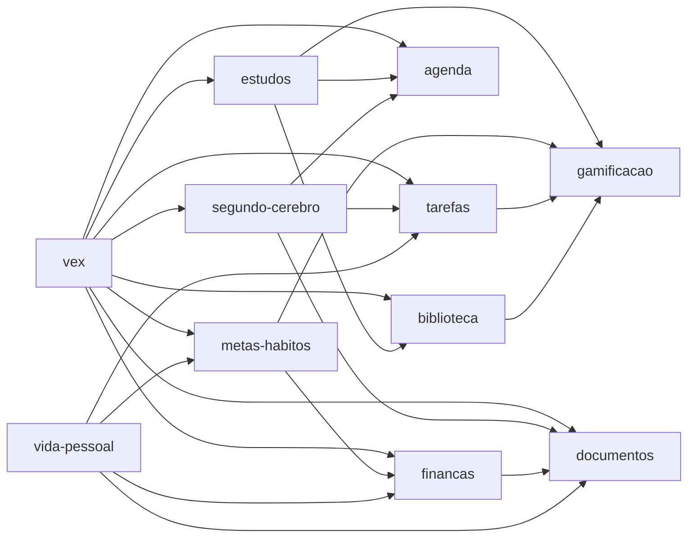

# Qqorvex

**Um app de gestão de vida pessoal com uma assistente de IA própria, a Vex.**

Tarefas, agenda, metas e hábitos, estudos, segundo cérebro, biblioteca, documentos, finanças e vida pessoal num único lugar — com a Vex conversando, consultando e agindo em todos esses módulos, sempre pedindo confirmação antes de mudar qualquer dado.

> Idioma da interface: **pt-BR**, com a base preparada para internacionalização.
> Regra de ouro do projeto: **custo R$ 0** de desenvolvimento e operação inicial — só free tier e código aberto.

---

## Sumário

- [Números do projeto](#números-do-projeto)
- [Stack](#stack)
- [Como rodar](#como-rodar)
- [Arquitetura](#arquitetura)
- [Estrutura de pastas](#estrutura-de-pastas)
- [Inventário de telas](#inventário-de-telas)
- [Módulos de domínio](#módulos-de-domínio)
  - [Hoje](#hoje) · [Tarefas](#tarefas) · [Agenda](#agenda) · [Metas & Hábitos](#metas--hábitos) · [Estudos](#estudos) · [Segundo Cérebro](#segundo-cérebro) · [Biblioteca](#biblioteca) · [Documentos](#documentos) · [Finanças](#finanças) · [Vida Pessoal](#vida-pessoal) · [Gamificação](#gamificação)
- [Pacotes compartilhados](#pacotes-compartilhados)
- [Vex — as 30 ferramentas](#vex--as-30-ferramentas)
- [Backend (Supabase)](#backend-supabase)
- [Segurança](#segurança)
- [Testes](#testes)
- [Design system](#design-system)
- [Documentação de decisões](#documentação-de-decisões)
- [Limitações conhecidas](#limitações-conhecidas)

---

## Números do projeto

| | |
|---|---|
| Telas (rotas) | **16** — 14 autenticadas + `/login` + `/mfa` |
| Módulos de domínio | **11** |
| Pacotes compartilhados | **6** |
| Funções, hooks e componentes exportados | **679** |
| Ferramentas da Vex | **30** (9 de leitura, 21 com confirmação) |
| Tabelas no banco | **79**, todas com RLS |
| Migrations versionadas | **27** |
| Edge Functions | **4** |
| Testes automatizados | **87** (Vitest) |

---

## Stack

| Camada | Tecnologia |
|---|---|
| Runtime | Node.js ≥ 22 · pnpm 9 (workspaces) |
| Linguagem | TypeScript 5.7 (`strict`, `noUncheckedIndexedAccess`) |
| Frontend | React 19 · Vite 6 · React Router 7 |
| Estilo | Tailwind CSS v4 com tokens próprios (`@theme`) |
| Dados no cliente | TanStack Query v5 |
| Backend | Supabase — Postgres, Auth, Storage, Edge Functions (Deno), `pg_cron` |
| IA | Camada própria (`packages/vex`), independente de fornecedor; Ollama local no desenvolvimento |
| Testes | Vitest |
| Bibliotecas de destaque | `@dnd-kit/core` (Kanban) · `d3-force` (grafo) · KaTeX (equações) · Tesseract.js (OCR) · `web-push` |

Alvo de distribuição: web, e Windows/Android empacotados com Tauri 2 (ainda não configurado).

---

## Como rodar

### Requisitos

- Node.js 22 ou superior
- pnpm 9 (`npm install -g pnpm@9`)
- Um projeto Supabase (o app aponta para o projeto `qqorvex`, região `sa-east-1`)
- Opcional: [Ollama](https://ollama.com) com um modelo que suporte *tools*, para a Vex usar IA de verdade

### Passo a passo

```bash
pnpm install
cp apps/qqorvex/.env.example apps/qqorvex/.env   # depois preencha os valores
pnpm dev                                          # http://localhost:5173
```

Para a Vex com IA local:

```bash
ollama pull qwen2.5:7b
```

Sem o Ollama rodando, a Vex **não trava**: o `ResilientProvider` cai automaticamente para o `EchoProvider`, que entende comandos simples em português, e volta a tentar o Ollama na mensagem seguinte.

### Variáveis de ambiente (`apps/qqorvex/.env`)

| Variável | Para quê | Obrigatória |
|---|---|---|
| `VITE_SUPABASE_URL` | URL do projeto Supabase | Sim |
| `VITE_SUPABASE_PUBLISHABLE_KEY` | Chave pública do Supabase (protegida por RLS) | Sim |
| `VITE_OLLAMA_MODEL` | Modelo Ollama da Vex (padrão `qwen2.5:7b`) | Não |
| `VITE_VAPID_PUBLIC_KEY` | Chave pública VAPID para notificações push | Para push |
| `VITE_GOOGLE_CLIENT_ID` | Client ID OAuth para conectar o Google Calendar | Para Google Calendar |
| `VITE_TMDB_API_KEY` | Chave da API do TMDB para metadados de filmes e séries | Para TMDB |

Segredos de servidor — chave privada VAPID, segredo do cron, credenciais do Zoom, client secret do Google — **nunca** ficam no cliente: vivem na tabela `public.app_secrets`, que só a `service_role` das Edge Functions consegue ler.

### Scripts

| Comando | O que faz |
|---|---|
| `pnpm dev` | Sobe o app em modo desenvolvimento |
| `pnpm build` | Build de produção de todos os workspaces |
| `pnpm typecheck` | Verificação de tipos em todos os workspaces |
| `pnpm test` | Roda os 87 testes com Vitest |

---

## Arquitetura

### Camadas

```
apps/       aplicação React (rotas, layout, integração da Vex)
modules/    domínios de produto — cada um dono dos seus dados
packages/   código compartilhado (UI, auth, banco, Vex, notificações, tokens)
supabase/   migrations, Edge Functions
```

### Regras que o código respeita

- **Hoje é agregador puro.** Não tem dados próprios; cada módulo registra um *provider* com `registerHojeProvider()`, e o Hoje nunca importa os módulos que o alimentam.
- **A Vex nunca acessa o banco diretamente.** Toda ação passa por uma ferramenta que chama a API pública de um módulo.
- **Módulos só conversam pela API pública** (`index.ts`) uns dos outros.
- **Uma fonte de verdade por domínio.** Dados nunca são copiados entre módulos: relações são referências (`on delete set null`) ou tabelas de junção.
- **Estado derivado nunca é gravado.** Saldo, total de fatura, nível de XP, tarefa atrasada e progresso de meta são sempre calculados na hora por funções puras.
- **Toda mudança feita pela Vex exige confirmação** do usuário antes de executar.

### Anatomia de um módulo

Todo módulo de domínio tem os mesmos arquivos, e as tabelas de inventário abaixo seguem essa ordem:

| Arquivo | Responsabilidade |
|---|---|
| `types.ts` | Tipos do domínio |
| `service.ts` | **Regras de negócio e cálculos puros** — sem I/O, cobertos por testes |
| `repository.ts` | **Acesso ao Supabase** — CRUD respeitando RLS |
| `hooks/` | **Hooks React** com TanStack Query (consultas e mutações) |
| `components/` | **Componentes de interface** do módulo |
| `hoje-provider.ts` | O que o módulo contribui para a tela Hoje |
| `index.ts` | API pública — a única porta de entrada |

### Grafo de dependências entre pacotes

Sem ciclos. A seta aponta de quem **usa** para quem é **usado**.



Todos os módulos também usam `database`, `ui` e `module-hoje`.

---

## Estrutura de pastas

```
Qqorvex/
├── apps/qqorvex/            o app React
│   ├── public/sw.js         service worker das notificações push
│   └── src/
│       ├── app/             App.tsx (rotas), ProtectedLayout.tsx, cliente Supabase
│       ├── pages/           as 16 telas
│       ├── vex/             painel lateral, conversa e contextos da Vex
│       └── styles/          global.css
├── modules/
│   ├── hoje/
│   ├── organizacao/         tarefas · agenda · metas-habitos
│   ├── conhecimento/        estudos · segundo-cerebro · biblioteca
│   ├── gestao/              documentos · financas
│   └── pessoal/             vida-pessoal · gamificacao
├── packages/                auth · database · design-system · notifications · ui · vex
├── supabase/
│   ├── migrations/          27 migrations SQL
│   └── functions/           4 Edge Functions (Deno)
├── docs/
│   ├── architecture/        visão geral e stack
│   ├── decisions/           decisões de design de cada feature
│   └── design-system/       tokens e identidade visual
├── Vex/                     arte oficial da personagem Vex
└── Logotipos/               símbolo e wordmark da marca
```

---

## Inventário de telas

Todas as telas autenticadas compartilham o `ProtectedLayout`: **barra lateral** de navegação com 5 seções (Principal, Organização, Conhecimento, Gestão, Pessoal) e o **painel retrátil da Vex** na borda direita, que abre o chat sobre qualquer página. Cada página é carregada sob demanda (code-splitting por rota).

| # | Rota | Tela | O que dá para fazer |
|---|---|---|---|
| 1 | `/login` | **Login** | Entrar ou criar conta com e-mail e senha; entrar sem senha com **passkey**. |
| 2 | `/mfa` | **Verificação em duas etapas** | Digitar o código de 6 dígitos do app autenticador quando a conta tem 2FA ativo. |
| 3 | `/` | **Hoje** | Ver o resumo do dia montado por todos os módulos, com prioridade por item; acompanhar nível e XP; abrir a **Nota do Dia**; falar com a Vex; sair. |
| 4 | `/tarefas` | **Tarefas** | Capturar tarefa rápida; **Kanban** de 3 colunas com arrastar e soltar; lista completa com filtros por status, prioridade e tag; tarefas **recorrentes**. |
| 5 | `/agenda` | **Agenda** | Visões **Dia, Semana, Mês e Lista**; aba **Reuniões** com botão de entrar e criação de reunião **Zoom**; eventos **recorrentes**; evento rápido com lembrete e aviso de conflito. |
| 6 | `/metas-habitos` | **Metas & Hábitos** | Criar metas com marcos, check-ins, hábitos vinculados e **progresso financeiro derivado**; hábitos com sequência; **rotinas** que agrupam hábitos. |
| 7 | `/estudos` | **Estudos** | Listar, criar e excluir Cadernos. |
| 8 | `/estudos/:notebookId` | **Caderno** | Tópicos; resumos; **flashcards com repetição espaçada**; **quizzes** gerados pela Vex; erros & dúvidas; avaliações com evento na Agenda; itens da Biblioteca relacionados; documentos anexados. |
| 9 | `/segundo-cerebro` | **Segundo Cérebro** | Lista de páginas, **grafo de conhecimento** navegável e **Bases** com fórmulas, ordenação e filtro. |
| 10 | `/segundo-cerebro/:pageId` | **Página** | **Editor de blocos** com 19 tipos e slash menu; tags; links internos e **backlinks**; **checkpoints** com restauração. |
| 11 | `/biblioteca` | **Biblioteca** | Galeria de livros, filmes, séries e mais; novo item com **busca de metadados**, capa e detecção de duplicados; status, favorito e exclusão. |
| 12 | `/documentos` | **Documentos** | Upload com anti-duplicado; filtros por tipo e pasta; importante; **Cofre com PIN**; **versões**; **OCR**; **lixeira** de 30 dias; pastas; **garantias**. |
| 13 | `/financas` | **Finanças** | Saldo atual e projetado; nova movimentação com conta, cartão, categoria, forma de pagamento e veículo; contas; cartões e **faturas**; categorias; **recorrências e assinaturas**; **parcelamentos**; **orçamentos**; **calendário financeiro**. |
| 14 | `/vida-pessoal` | **Vida Pessoal** | Abas **Planejamento** (planos, projetos, ideias), **Bem-estar** (check-in diário, Pomodoro) e **Vida Prática** (contatos úteis, veículos, bens e inventário, compras importantes, lista de compras). |
| 15 | `/seguranca` | **Segurança** | Perfil; gamificação e badges; **2FA**; **passkeys**; **dispositivos conectados**; **PIN do Cofre**; notificações push; integração com **Google Calendar**. |
| 16 | `/vex` | **Vex** | Conversa com a Vex em tela cheia, com histórico de conversas persistido. |

### O que compõe cada tela

<details>
<summary><b>Componentes e hooks usados por tela</b></summary>

| Tela | Arquivo | Componentes e hooks |
|---|---|---|
| Hoje | `pages/Hoje.tsx` | `useHojeSummary`, `useEnsureDailyNote`, `useGamificationStats`, `GamificationWidget`, `Card`, `Badge` |
| Tarefas | `pages/Tarefas.tsx` | `QuickCapture`, `KanbanBoard`, `TaskListView`, `RecurringTasksPanel`, `useTasks`, `useAllTasks`, `useCreateTask`, `useUpdateTaskStatus`, `useUpdateTaskCancelled`, `useDeleteTask` |
| Agenda | `pages/Agenda.tsx` | `WeekStrip`, `DayAgenda`, `WeekView`, `MonthView`, `ListView`, `MeetingsView`, `QuickEventForm`, `NewZoomMeetingForm`, `RecurringEventsPanel`, `useEventsInRange`, `useCreateEvent`, `useDeleteEvent`, `useCreateZoomMeeting`, `findConflicts` |
| Metas & Hábitos | `pages/MetasHabitos.tsx` | `GoalCard`, `NewGoalForm`, `HabitCard`, `NewHabitForm`, `RoutinesPanel`, `useGoals`, `useHabits` e mutações |
| Estudos | `pages/Estudos.tsx` | `NewNotebookForm`, `NotebookCard`, `useNotebooks`, `useCreateNotebook`, `useDeleteNotebook` |
| Caderno | `pages/EstudosCaderno.tsx` | `FlashcardReviewCard`, `QuizTakingForm`, `RelatedLibraryItemsPanel`, `AttachDocumentPanel`, hooks de tópicos, resumos, flashcards, erros & dúvidas, avaliações e quizzes |
| Segundo Cérebro | `pages/SegundoCerebro.tsx` | `NewPageForm`, `PageCard`, `GraphView`, `BasesPanel`, `usePages`, `useAllPageLinks` |
| Página | `pages/SegundoCerebroPagina.tsx` | `BlockEditor`, `CheckpointsPanel`, `usePage`, `usePageTags`, `useBacklinks`, `useCreatePageLink` |
| Biblioteca | `pages/Biblioteca.tsx` | `NewItemForm`, `GalleryGrid`, `useLibraryItems`, `useCreateLibraryItemWithCreators`, `useUpdateItemStatus`, `useToggleFavorite` |
| Documentos | `pages/Documentos.tsx` | `UploadForm`, `DocumentCard`, `TrashPanel`, `VersionHistoryPanel`, `FoldersPanel`, `WarrantiesPanel`, `useExtractText`, `verifySecurityPin`, `getDownloadUrl` |
| Finanças | `pages/Financas.tsx` | `DashboardCards`, `NewTransactionForm`, `TransactionList`, `AccountsPanel`, `CardsPanel`, `CategoriesPanel`, `RecurringTransactionsPanel`, `InstallmentsPanel`, `BudgetsPanel`, `FinancialCalendarView`, `computeBalances`, `useVehicles` |
| Vida Pessoal | `pages/VidaPessoal.tsx` | `PlanCard`, `ProjectCard`, `IdeaCard`, `DailyCheckinForm`, `PomodoroTimer`, `UsefulContactsPanel`, `VehiclesPanel`, `AssetsPanel`, `ImportantPurchasesPanel`, `ShoppingListPanel` |
| Segurança | `pages/Seguranca.tsx` | `useProfile`, `useMfaFactors`, `usePasskeys`, `useSessions`, `usePin`, `useNotifications`, `GoogleCalendarSection`, `BadgesPanel`, `GamificationWidget`, `ConfirmDialog` |
| Login | `pages/Login.tsx` | `useAuth`, `signInWithPasskey` |
| 2FA | `pages/Mfa.tsx` | `useMfaFactors`, `verifyTotpChallenge`, `getAssuranceLevel`, `isMfaPending` |
| Vex | `pages/Vex.tsx` | `VexConversationView` (em `src/vex/`) |

**Peças da Vex no app** (`apps/qqorvex/src/vex/`):

| Arquivo | Papel |
|---|---|
| `VexPanel.tsx` | Aba retrátil na borda direita de toda página autenticada; abre o chat por cima do conteúdo. |
| `VexConversationView.tsx` | O chat em si: lista de conversas, mensagens, indicador "digitando…" e cartão de confirmação de ação. |
| `VexSessionContext.tsx` | Compartilha qual conversa está aberta entre o painel e a página `/vex`. |
| `CurrentItemContext.tsx` | Guarda o item em foco na tela (ex.: a tarefa clicada) para a Vex entender "muda o prazo **disso**". |

</details>

## Módulos de domínio

Cada módulo vive em `modules/<área>/<nome>` e segue o mesmo padrão de camadas. As tabelas abaixo listam **todas** as funções, hooks e componentes exportados pela API pública (`index.ts`) de cada um.

### Hoje

`@qqorvex/module-hoje` · `modules/hoje` · rota `/` · 3 exports

Agregador puro do dia. Não tem tabela nem dado próprio: cada módulo registra um *provider* que contribui itens, e o Hoje só junta e ordena. Não depende de nenhum módulo.

**Depende de:** nenhum outro pacote

**Regras de negócio**

- `HojeItem { id, source, title, time?, priority? }` com prioridades `informativo`, `atencao`, `importante` e `urgente`.
- O registro acontece em `App.tsx` (`ModuleRegistrations`), então o Hoje nunca importa os módulos que o alimentam.

<details>
<summary><b>Inventário de funções de Hoje</b> (3)</summary>

**Funções** (2)

| Função / componente | Arquivo | O que faz |
|---|---|---|
| `registerHojeProvider(provider)` | `registry.ts` | Chamado pela API pública de um módulo (ex.: `modules/organizacao/tarefas`) para contribuir itens ao resumo do dia. |
| `getHojeSummary()` | `registry.ts` | Executa todos os providers registrados em paralelo e junta os itens em um único resumo ordenado por horário. |

**Hooks React (TanStack Query)** (1)

| Função / componente | Arquivo | O que faz |
|---|---|---|
| `useHojeSummary()` | `hooks/useHojeSummary.ts` | Hook que consulta todos os providers registrados e devolve os itens do dia ordenados por horário. |

</details>

### Tarefas

`@qqorvex/module-tarefas` · `modules/organizacao/tarefas` · rota `/tarefas` · 33 exports

Kanban de tarefas, lista completa com filtros e tarefas recorrentes.

**Tabelas:** `tasks`, `task_checklist_items`, `task_dependencies`, `recurring_tasks`

**Depende de:** `@qqorvex/database`, `@qqorvex/module-gamificacao`, `@qqorvex/module-hoje`, `@qqorvex/ui` · externas: `@dnd-kit/core`

**Regras de negócio**

- Exatamente **3 estados** persistidos: `nao_iniciado`, `em_andamento`, `concluido`.
- *Atrasada* e *bloqueada* são **condições derivadas** (`deriveTaskConditions`), nunca estados salvos; tarefa cancelada nunca conta como atrasada.
- Dependências não podem formar ciclo (`wouldCreateCycle`, validado na camada de serviço).
- Tarefas recorrentes são geradas **automaticamente** pela Edge Function `send-notifications` (cron), que reimplementa `computeNextTaskOccurrenceDate`.
- Concluir tarefa concede XP via `awardXp` dentro do repository — vale também quando a ação vem da Vex.

<details>
<summary><b>Inventário de funções de Tarefas</b> (33)</summary>

**Regras de negócio e cálculos (funções puras)** (3)

| Função / componente | Arquivo | O que faz |
|---|---|---|
| `deriveTaskConditions(tasks, edges)` | `service.ts` | "Atrasada" e "Bloqueada" são condições calculadas, nunca colunas de estado do Kanban (regra explícita do módulo). |
| `wouldCreateCycle(edges, taskId, dependsOnTaskId)` | `service.ts` | "Não criar ciclo de dependências; validar isso no módulo." Verifica, antes de inserir uma aresta nova, se ela criaria um ciclo (busca a partir de dependsOnTaskId até taskId). |
| `computeNextTaskOccurrenceDate(currentDate, frequency)` | `service.ts` | "A frequência determina automaticamente a próxima data" — mesmo espírito de `computeNextOccurrenceDate` em Finanças, mas com as frequências de Tarefas (diária/semanal/mensal, sem dias específicos da semana — corte consciente, ver docs/decisions/tarefas-recorr… |

**Acesso a dados (Supabase)** (13)

| Função / componente | Arquivo | O que faz |
|---|---|---|
| `listActiveTasks(client)` | `repository.ts` | Lista tarefas ativas no Supabase (respeitando RLS). |
| `listAllTasks(client)` | `repository.ts` | "Todas as Tarefas" — ao contrário do Kanban, inclui canceladas e subtarefas. |
| `listDependencyEdges(client)` | `repository.ts` | Lista arestas de dependência entre tarefas no Supabase (respeitando RLS). |
| `createTask(client, userId, input)` | `repository.ts` | Cria tarefa no Supabase (respeitando RLS). |
| `updateTaskStatus(client, taskId, status)` | `repository.ts` | Confere o status anterior antes de gravar pra premiar XP só na transição pra "concluido" — desfazer e refazer a mesma conclusão não deve dobrar o XP . |
| `updateTask(client, taskId, updates)` | `repository.ts` | Atualização genérica por ID — diferente de `updateTaskStatus`/`updateTaskCancelled` (que só mexem em um campo cada), esta cobre o caso do Context Engine da Vex: "muda o prazo disso pra amanhã" chega como um ID exato + campos parciais, não um dos fluxos de UI… |
| `deleteTask(client, taskId)` | `repository.ts` | Exclui tarefa no Supabase (respeitando RLS). |
| `updateTaskCancelled(client, taskId, isCancelled)` | `repository.ts` | Cancelar não é um estado do Kanban (regra do módulo) — é a flag `is_cancelled`, gerenciável só em "Todas as Tarefas". |
| `addDependency(client, taskId, dependsOnTaskId)` | `repository.ts` | Adiciona dependência entre tarefas no Supabase (respeitando RLS). |
| `listRecurringTasks(client)` | `repository.ts` | Lista tarefas recorrentes no Supabase (respeitando RLS). |
| `createRecurringTask(client, userId, input)` | `repository.ts` | Cria tarefa recorrente no Supabase (respeitando RLS). |
| `updateRecurringTaskStatus(client, id, status)` | `repository.ts` | Atualiza status (ativa/pausada) da tarefa recorrente no Supabase (respeitando RLS). |
| `generateTaskOccurrence(client, userId, recurring)` | `repository.ts` | "Cada ocorrência é uma tarefa vinculada à recorrência." Cria a ocorrência como tarefa comum e independente (editar/completar/apagar depois não afeta a série) e avança `next_occurrence_date` — a recorrência nunca é, em si, uma tarefa. |

**Hooks React (TanStack Query)** (10)

| Função / componente | Arquivo | O que faz |
|---|---|---|
| `useAllTasks(client)` | `hooks/useTasks.ts` | "Todas as Tarefas" — mesmo hook shape de `useTasks`, mas sobre `listAllTasks()` (inclui canceladas e subtarefas). |
| `useUpdateTaskCancelled(client)` | `hooks/useTasks.ts` | Hook de mutação (TanStack Query): atualiza cancelamento da tarefa e invalida as consultas afetadas. |
| `useTasks(client)` | `hooks/useTasks.ts` | Hook de consulta (TanStack Query) que carrega tarefas. |
| `useCreateTask(client, userId)` | `hooks/useTasks.ts` | Hook de mutação (TanStack Query): cria tarefa e invalida as consultas afetadas. |
| `useUpdateTaskStatus(client)` | `hooks/useTasks.ts` | Hook de mutação (TanStack Query): atualiza status da tarefa e invalida as consultas afetadas. |
| `useDeleteTask(client)` | `hooks/useTasks.ts` | Hook de mutação (TanStack Query): exclui tarefa e invalida as consultas afetadas. |
| `useRecurringTasks(client)` | `hooks/useTasks.ts` | Hook de consulta (TanStack Query) que carrega tarefas recorrentes. |
| `useCreateRecurringTask(client, userId)` | `hooks/useTasks.ts` | Hook de mutação (TanStack Query): cria tarefa recorrente e invalida as consultas afetadas. |
| `useUpdateRecurringTaskStatus(client)` | `hooks/useTasks.ts` | Hook de mutação (TanStack Query): atualiza status (ativa/pausada) da tarefa recorrente e invalida as consultas afetadas. |
| `useAddDependency(client)` | `hooks/useTasks.ts` | Hook de mutação (TanStack Query): adiciona dependência entre tarefas e invalida as consultas afetadas. |

**Componentes de interface** (5)

| Função / componente | Arquivo | O que faz |
|---|---|---|
| `KanbanBoard({ tasks, onMove, onDelete, focusedTaskId, onFocus, })` | `components/KanbanBoard.tsx` | "Mover tarefa no Kanban" via arrastar-e-soltar entre colunas (Web/Windows) — os botões "mover para" continuam disponíveis como alternativa acessível/touch. |
| `QuickCapture({ onCapture })` | `components/QuickCapture.tsx` | "Para captura rápida, somente o título precisa ser obrigatório." A tarefa pode ser organizada depois com prazo, prioridade, projeto, tags e demais campos. |
| `RecurringTasksPanel({ client, userId })` | `components/RecurringTasksPanel.tsx` | A próxima ocorrência é gerada sozinha (cron em `send-notifications`, a cada 5 min) — sem botão "Gerar agora" aqui de propósito . |
| `TaskCard({ task, onMove, onDelete, isFocused, onFocus, })` | `components/TaskCard.tsx` | Card de tarefa: condições derivadas (atrasada/bloqueada), foco para a Vex e arraste no Kanban. |
| `TaskListView({ tasks, onChangeStatus, onToggleCancelled, onDelete, })` | `components/TaskListView.tsx` | "Todas as Tarefas" + "Tags & Filtros" — ao contrário do Kanban (só 3 estados ativos, sem subtarefas), mostra tudo: canceladas (escondidas por padrão) e subtarefas, com filtro por status/prioridade/tag. |

**Integração com o Hoje** (1)

| Função / componente | Arquivo | O que faz |
|---|---|---|
| `createTasksHojeProvider(client)` | `hoje-provider.ts` | "Hoje pode mostrar resumo compacto: tarefas para hoje, atrasadas relevantes, em andamento, prioridade alta. |

**Tipos e constantes** (1)

| Função / componente | Arquivo | O que faz |
|---|---|---|
| `toTaskInsert(userId, input)` | `types.ts` | Converte os dados do formulário para o formato de gravação de tarefa (mapeamento de campos para a tabela). |

</details>

### Agenda

`@qqorvex/module-agenda` · `modules/organizacao/agenda` · rota `/agenda` · 51 exports

Calendário com visões Dia, Semana, Mês, Lista e Reuniões, lembretes, eventos recorrentes e integrações com Zoom e Google Calendar.

**Tabelas:** `events`, `event_reminders`, `recurring_events`, `google_calendar_connections`, `google_oauth_states`, `pending_google_deletions`

**Depende de:** `@qqorvex/database`, `@qqorvex/module-hoje`, `@qqorvex/ui`

**Regras de negócio**

- Criar evento sobreposto a outro exige **confirmação explícita** (`findConflicts`, considerando buffers); `findFreeSlots` sugere horários livres.
- `task_id` e `assessment_id` referenciam Tarefas e Estudos sem copiar (`on delete set null`).
- Zoom: app Server-to-Server; a Edge Function só cria a reunião, o evento é gravado pelo cliente reaproveitando a checagem de conflito.
- Google Calendar: sincronização nos dois sentidos a cada 10 min, "quem editou por último vence", calendário dedicado "Qqorvex".
- Evento recorrente gerado pelo cron que colide com outro **é criado mesmo assim** e o usuário é avisado por push.

<details>
<summary><b>Inventário de funções de Agenda</b> (51)</summary>

**Regras de negócio e cálculos (funções puras)** (13)

| Função / componente | Arquivo | O que faz |
|---|---|---|
| `startOfDay(date)` | `dateUtils.ts` | Utilitários de data puros, compartilhados pelas visões Dia/Semana/Mês/Lista do Calendário Completo. |
| `endOfDay(date)` | `dateUtils.ts` | Fim do dia (23:59:59.999). |
| `addDays(date, days)` | `dateUtils.ts` | Soma dias a uma data. |
| `addMonths(date, months)` | `dateUtils.ts` | Soma meses a uma data. |
| `startOfWeek(date)` | `dateUtils.ts` | Domingo como início da semana, mesma convenção já usada pela `WeekStrip`. |
| `endOfWeek(date)` | `dateUtils.ts` | Fim da semana. |
| `startOfMonth(date)` | `dateUtils.ts` | Início do mês. |
| `endOfMonth(date)` | `dateUtils.ts` | Fim do mês. |
| `isSameDay(a, b)` | `dateUtils.ts` | Compara se duas datas são o mesmo dia. |
| `findConflicts(events, candidate)` | `service.ts` | "Antes de criar/editar, o sistema deve identificar sobreposição relevante." Buffers contam para a checagem de conflito mas não alteram o horário oficial do evento. |
| `findFreeSlots(events, rangeStart, rangeEnd, durationMinutes)` | `service.ts` | "Agenda pode calcular intervalos livres considerando eventos, blocos e buffers." Retorna janelas livres dentro do intervalo pedido com pelo menos `durationMinutes`. |
| `buildGoogleAuthUrl(input)` | `service.ts` | `state` é um token opaco gerado no servidor (linha em `google_oauth_states`), não algo autoverificável — evita precisar de segredo de assinatura no cliente. |
| `computeNextEventOccurrenceDate(currentDate, frequency)` | `service.ts` | "A frequência determina automaticamente a próxima data" — mesma lógica de `computeNextTaskOccurrenceDate` em Tarefas, mas própria de Agenda (sem importar o módulo de Tarefas pra isso). |

**Acesso a dados (Supabase)** (15)

| Função / componente | Arquivo | O que faz |
|---|---|---|
| `listEventsInRange(client, rangeStartIso, rangeEndIso)` | `repository.ts` | Lista eventos de um intervalo de datas no Supabase (respeitando RLS). |
| `listAllEvents(client)` | `repository.ts` | "Listar tudo" (sem filtro de período) — usado pelo picker de Referência de Entidade do Segundo Cérebro. |
| `createEvent(client, userId, input)` | `repository.ts` | Cria evento no Supabase (respeitando RLS). |
| `createEventReminder(client, eventId, minutesBefore)` | `repository.ts` | "Lembretes têm tabela mas nada os dispara" — agora dispara via `send-notifications` (pg_cron). |
| `listEventReminders(client, eventId)` | `repository.ts` | Lista lembretes de evento no Supabase (respeitando RLS). |
| `deleteEvent(client, eventId)` | `repository.ts` | Continua exclusão física direta (sem lixeira) — comportamento inalterado. |
| `listEventsByAssessment(client, assessmentId)` | `repository.ts` | "Agenda apresenta a representação temporal... não duplicar o registro principal." Usado antes de criar um evento derivado de uma avaliação, para não gerar duas ocorrências pra mesma prova. |
| `createZoomMeeting(client, input)` | `repository.ts` | Só fala com a API do Zoom (via Edge Function `create-zoom-meeting`) e devolve o link — não cria o evento sozinha. |
| `getGoogleCalendarConnection(client)` | `repository.ts` | Não expõe o `refresh_token` pro chamador — só o suficiente pra UI mostrar "conectado". |
| `disconnectGoogleCalendar(client, userId)` | `repository.ts` | Só apaga a conexão — nunca apaga eventos já sincronizados nos dois lados. |
| `createGoogleOAuthState(client, userId)` | `repository.ts` | Gera o token opaco (`id`) que vira o parâmetro `state` do redirecionamento OAuth do Google. |
| `listRecurringEvents(client)` | `repository.ts` | Lista eventos recorrentes no Supabase (respeitando RLS). |
| `createRecurringEvent(client, userId, input)` | `repository.ts` | Cria evento recorrente no Supabase (respeitando RLS). |
| `updateRecurringEventStatus(client, id, status)` | `repository.ts` | Atualiza status do evento recorrente no Supabase (respeitando RLS). |
| `generateEventOccurrence(client, userId, recurring)` | `repository.ts` | "Cada ocorrência é um evento vinculado à recorrência." Combina `next_occurrence_date` + `start_time`/`end_time` (dia inteiro vira 00:00:00–23:59:59, mesmo padrão de `QuickEventForm`) em `start_at`/`end_at`, cria o evento de verdade e avança `next_occurrence_d… |

**Hooks React (TanStack Query)** (11)

| Função / componente | Arquivo | O que faz |
|---|---|---|
| `useEventsInRange(client, rangeStart, rangeEnd)` | `hooks/useEvents.ts` | Hook de consulta (TanStack Query) que carrega eventos de um intervalo de datas. |
| `useAllEvents(client)` | `hooks/useEvents.ts` | Hook de consulta (TanStack Query) que carrega todos os eventos. |
| `useCreateEvent(client, userId)` | `hooks/useEvents.ts` | Hook de mutação (TanStack Query): cria evento e invalida as consultas afetadas. |
| `useDeleteEvent(client)` | `hooks/useEvents.ts` | Hook de mutação (TanStack Query): exclui evento e invalida as consultas afetadas. |
| `useCreateZoomMeeting(client, userId)` | `hooks/useEvents.ts` | Cria a reunião no Zoom e, com o link retornado, cria o evento na Agenda numa única ação. |
| `useGoogleCalendarConnection(client)` | `hooks/useGoogleCalendar.ts` | Hook de consulta (TanStack Query) que carrega conexão com o Google Calendar. |
| `useConnectGoogleCalendar(client, userId, redirectUri, clientId)` | `hooks/useGoogleCalendar.ts` | Gera o token de estado opaco e redireciona pro consentimento do Google — não é uma mutation comum porque o "resultado" é sair da página, não uma resposta pra tratar aqui. |
| `useDisconnectGoogleCalendar(client, userId)` | `hooks/useGoogleCalendar.ts` | Hook de mutação (TanStack Query): desconecta integração com o Google Calendar e invalida as consultas afetadas. |
| `useRecurringEvents(client)` | `hooks/useRecurringEvents.ts` | Hook de consulta (TanStack Query) que carrega eventos recorrentes. |
| `useCreateRecurringEvent(client, userId)` | `hooks/useRecurringEvents.ts` | Hook de mutação (TanStack Query): cria evento recorrente e invalida as consultas afetadas. |
| `useUpdateRecurringEventStatus(client)` | `hooks/useRecurringEvents.ts` | Hook de mutação (TanStack Query): atualiza status do evento recorrente e invalida as consultas afetadas. |

**Componentes de interface** (10)

| Função / componente | Arquivo | O que faz |
|---|---|---|
| `DayAgenda({ events, onDelete, })` | `components/DayAgenda.tsx` | "Meu Dia": timeline do dia selecionado em ordem cronológica, com eventos de dia inteiro separados da linha horária. |
| `GoogleCalendarSection({ client, userId, supabaseUrl, googleClientId, })` | `components/GoogleCalendarSection.tsx` | Sincronização bidirecional completa com um calendário "Qqorvex" dedicado (não o pessoal) — ver docs/decisions/integracoes-agenda-design.md. |
| `ListView({ events, onDelete })` | `components/ListView.tsx` | Lista cronológica agrupada por dia — útil para varrer um período mais longo sem trocar de tela. |
| `MeetingsView({ events, onDelete })` | `components/MeetingsView.tsx` | "Reuniões dedicadas" — recorte da Agenda só com `category === "reuniao"`, sem duplicar o registro do evento; o link fica em destaque para entrar direto. |
| `MonthView({ monthAnchor, events, selectedDate, onSelectDate, })` | `components/MonthView.tsx` | Mês inteiro em grade; dias fora do mês corrente ficam esmaecidos mas continuam clicáveis. |
| `NewZoomMeetingForm({ onCreate, isCreating, }: { onCreate: (input) => Promise<unknown>; i…)` | `components/NewZoomMeetingForm.tsx` | Cria a reunião no Zoom e o evento na Agenda numa única ação — sem precisar criar o evento manualmente antes (decisão explícita do usuário). |
| `QuickEventForm({ selectedDate, checkConflicts, onCreate, })` | `components/QuickEventForm.tsx` | "Criação rápida deve aceitar somente o necessário e permitir completar os detalhes depois." "Antes de criar/editar, o sistema deve identificar sobreposição relevante" — checkConflicts roda antes de persistir; se houver conflito, exige confirmação explícita ("… |
| `RecurringEventsPanel({ client, userId })` | `components/RecurringEventsPanel.tsx` | A próxima ocorrência é gerada sozinha (cron em `send-notifications`, a cada 5 min) — sem botão "Gerar agora" aqui de propósito, mesmo padrão de `RecurringTasksPanel` . |
| `WeekStrip({ selectedDate, onSelectDate, })` | `components/WeekStrip.tsx` | "A visão reduzida/padrão mostra somente uma semana por vez... permite selecionar um dia e ver a agenda daquele dia sem exibir o calendário inteiro." Navegação semana anterior/próxima. |
| `WeekView({ weekAnchor, events, selectedDate, onSelectDate, })` | `components/WeekView.tsx` | Semana completa: os 7 dias lado a lado, cada um já mostrando seus eventos (sem precisar clicar). |

**Integração com o Hoje** (1)

| Função / componente | Arquivo | O que faz |
|---|---|---|
| `createAgendaHojeProvider(client)` | `hoje-provider.ts` | "Hoje pode mostrar: próximos eventos, próxima reunião, próximo bloco de foco, resumo do dia." Hoje só chama esta função através do registry — nunca importa este módulo diretamente. |

**Tipos e constantes** (1)

| Função / componente | Arquivo | O que faz |
|---|---|---|
| `toEventInsert(userId, input)` | `types.ts` | Converte os dados do formulário para o formato de gravação de evento (mapeamento de campos para a tabela). |

</details>

### Metas & Hábitos

`@qqorvex/module-metas-habitos` · `modules/organizacao/metas-habitos` · rota `/metas-habitos` · 63 exports

Metas com marcos e check-ins, hábitos com sequência, rotinas que agrupam hábitos e vínculo meta↔hábito.

**Tabelas:** `goals`, `goal_milestones`, `goal_checkins`, `habits`, `habit_logs`, `goal_habit_relations`, `routines`, `routine_habits`

**Depende de:** `@qqorvex/database`, `@qqorvex/module-financas`, `@qqorvex/module-gamificacao`, `@qqorvex/module-hoje`, `@qqorvex/ui`

**Regras de negócio**

- Hierarquia de metas limitada a **principal + submeta** (validada em `canBeSubGoal`).
- Progresso *por marcos* é calculado dos marcos concluídos; progresso *derivado* acompanha o saldo de uma Conta de Finanças contra um alvo (`computeDerivedProgress`).
- Sequência de hábito calculada sem linguagem punitiva (`computeCurrentStreak`).
- Rotinas permitem marcar vários hábitos do dia de uma vez (concluído, parcial, pulado).

<details>
<summary><b>Inventário de funções de Metas & Hábitos</b> (63)</summary>

**Regras de negócio e cálculos (funções puras)** (4)

| Função / componente | Arquivo | O que faz |
|---|---|---|
| `canBeSubGoal(candidateParent)` | `service.ts` | "Suportar inicialmente no máximo: Meta principal, Submetas de primeiro nível." Uma submeta não pode, por sua vez, ter uma submeta (profundidade máxima 2). |
| `computeMilestoneProgress(milestones)` | `service.ts` | "Por marcos: progresso baseado em marcos concluídos." Só se aplica quando progress_type da meta for 'marcos'; retorna null sem marcos (não inventar progresso). |
| `computeCurrentStreak(logs, referenceDate)` | `service.ts` | "Sequência atual" — dias consecutivos com registro 'concluido' terminando na data de referência (ou no dia mais recente com registro, o que vier primeiro). |
| `computeDerivedProgress(currentBalance, targetAmount)` | `service.ts` | "Derivado: progresso baseado em dado de outro módulo" — hoje só Finanças (saldo de Conta vs. |

**Acesso a dados (Supabase)** (25)

| Função / componente | Arquivo | O que faz |
|---|---|---|
| `listGoals(client)` | `repository.ts` | Lista metas no Supabase (respeitando RLS). |
| `createGoal(client, userId, input)` | `repository.ts` | Cria meta no Supabase (respeitando RLS). |
| `updateGoalStatus(client, goalId, status)` | `repository.ts` | Atualiza status da meta no Supabase (respeitando RLS). |
| `updateGoalProgressSource(client, goalId, input)` | `repository.ts` | Vincula/desvincula uma meta a uma Conta de Finanças pra progresso "derivado" — ou volta pra `binario` quando desvinculada (`accountId`/`targetAmount` nulos limpam a vinculação). |
| `deleteGoal(client, goalId)` | `repository.ts` | Exclui meta no Supabase (respeitando RLS). |
| `listMilestones(client, goalId)` | `repository.ts` | Lista marcos da meta no Supabase (respeitando RLS). |
| `createMilestone(client, goalId, title)` | `repository.ts` | Cria marco da meta no Supabase (respeitando RLS). |
| `toggleMilestone(client, milestoneId, isDone)` | `repository.ts` | Alterna marco da meta no Supabase (respeitando RLS). |
| `createCheckin(client, goalId, input)` | `repository.ts` | Todo check-in registrado é um sinal real de engajamento — premia XP sempre, sem checar estado anterior (é sempre um insert novo, nunca upsert). |
| `listHabits(client)` | `repository.ts` | Lista hábitos no Supabase (respeitando RLS). |
| `createHabit(client, userId, input)` | `repository.ts` | Cria hábito no Supabase (respeitando RLS). |
| `updateHabitStatus(client, habitId, status)` | `repository.ts` | Atualiza status do hábito no Supabase (respeitando RLS). |
| `deleteHabit(client, habitId)` | `repository.ts` | Exclui hábito no Supabase (respeitando RLS). |
| `listHabitLogs(client, habitId)` | `repository.ts` | Lista registros de execução de hábito no Supabase (respeitando RLS). |
| `logHabit(client, habitId, logDate, state)` | `repository.ts` | Upsert por (habit_id, log_date): registrar de novo no mesmo dia substitui o registro anterior em vez de criar duplicata (a unique constraint do banco garante isso). |
| `linkGoalHabit(client, goalId, habitId)` | `repository.ts` | Vincula vínculo meta↔hábito no Supabase (respeitando RLS). |
| `listGoalHabitRelations(client)` | `repository.ts` | Lista vínculos meta↔hábito no Supabase (respeitando RLS). |
| `unlinkGoalHabit(client, goalId, habitId)` | `repository.ts` | Desvincula vínculo meta↔hábito no Supabase (respeitando RLS). |
| `listRoutines(client)` | `repository.ts` | "Rotina agrupa hábitos para check-off em conjunto." Rotina nunca copia o hábito — só referencia via `routine_habits`, uma junção N:N (mesmo padrão de `goal_habit_relations`). |
| `createRoutine(client, userId, name)` | `repository.ts` | Cria rotina no Supabase (respeitando RLS). |
| `deleteRoutine(client, routineId)` | `repository.ts` | Exclui rotina no Supabase (respeitando RLS). |
| `addHabitToRoutine(client, routineId, habitId)` | `repository.ts` | Adiciona hábito a uma rotina no Supabase (respeitando RLS). |
| `removeHabitFromRoutine(client, routineId, habitId)` | `repository.ts` | Remove hábito de uma rotina no Supabase (respeitando RLS). |
| `listRoutineHabits(client)` | `repository.ts` | Lista hábitos de uma rotina no Supabase (respeitando RLS). |
| `listHabitLogsForDate(client, logDate)` | `repository.ts` | Todos os registros de hábito do usuário numa data — RLS já restringe aos próprios hábitos. |

**Hooks React (TanStack Query)** (26)

| Função / componente | Arquivo | O que faz |
|---|---|---|
| `useGoals(client)` | `hooks/useGoals.ts` | Hook de consulta (TanStack Query) que carrega metas. |
| `useCreateGoal(client, userId)` | `hooks/useGoals.ts` | Hook de mutação (TanStack Query): cria meta e invalida as consultas afetadas. |
| `useUpdateGoalStatus(client)` | `hooks/useGoals.ts` | Hook de mutação (TanStack Query): atualiza status da meta e invalida as consultas afetadas. |
| `useDeleteGoal(client)` | `hooks/useGoals.ts` | Hook de mutação (TanStack Query): exclui meta e invalida as consultas afetadas. |
| `useUpdateGoalProgressSource(client)` | `hooks/useGoals.ts` | Hook de mutação (TanStack Query): atualiza fonte de progresso derivado da meta (conta de Finanças) e invalida as consultas afetadas. |
| `useMilestones(client, goalId)` | `hooks/useGoals.ts` | Hook de consulta (TanStack Query) que carrega marcos da meta. |
| `useCreateMilestone(client, goalId)` | `hooks/useGoals.ts` | Hook de mutação (TanStack Query): cria marco da meta e invalida as consultas afetadas. |
| `useToggleMilestone(client, goalId)` | `hooks/useGoals.ts` | Hook de mutação (TanStack Query): alterna marco da meta e invalida as consultas afetadas. |
| `useCreateCheckin(client, goalId)` | `hooks/useGoals.ts` | Hook de mutação (TanStack Query): cria check-in de meta e invalida as consultas afetadas. |
| `useGoalHabitRelations(client)` | `hooks/useGoals.ts` | "A relação meta↔hábito existe no banco mas a UI ainda não a expõe" — agora expõe. |
| `useLinkGoalHabit(client)` | `hooks/useGoals.ts` | Hook de mutação (TanStack Query): vincula vínculo meta↔hábito e invalida as consultas afetadas. |
| `useUnlinkGoalHabit(client)` | `hooks/useGoals.ts` | Hook de mutação (TanStack Query): desvincula vínculo meta↔hábito e invalida as consultas afetadas. |
| `useHabits(client)` | `hooks/useHabits.ts` | Hook de consulta (TanStack Query) que carrega hábitos. |
| `useCreateHabit(client, userId)` | `hooks/useHabits.ts` | Hook de mutação (TanStack Query): cria hábito e invalida as consultas afetadas. |
| `useUpdateHabitStatus(client)` | `hooks/useHabits.ts` | Hook de mutação (TanStack Query): atualiza status do hábito e invalida as consultas afetadas. |
| `useDeleteHabit(client)` | `hooks/useHabits.ts` | Hook de mutação (TanStack Query): exclui hábito e invalida as consultas afetadas. |
| `useHabitLogs(client, habitId)` | `hooks/useHabits.ts` | Hook de consulta (TanStack Query) que carrega registros de execução de hábito. |
| `useLogHabit(client, habitId)` | `hooks/useHabits.ts` | Hook de mutação (TanStack Query): registra hábito e invalida as consultas afetadas. |
| `useRoutines(client)` | `hooks/useRoutines.ts` | Hook de consulta (TanStack Query) que carrega rotinas. |
| `useCreateRoutine(client, userId)` | `hooks/useRoutines.ts` | Hook de mutação (TanStack Query): cria rotina e invalida as consultas afetadas. |
| `useDeleteRoutine(client)` | `hooks/useRoutines.ts` | Hook de mutação (TanStack Query): exclui rotina e invalida as consultas afetadas. |
| `useRoutineHabits(client)` | `hooks/useRoutines.ts` | Hook de consulta (TanStack Query) que carrega hábitos de uma rotina. |
| `useAddHabitToRoutine(client)` | `hooks/useRoutines.ts` | Hook de mutação (TanStack Query): adiciona hábito a uma rotina e invalida as consultas afetadas. |
| `useRemoveHabitFromRoutine(client)` | `hooks/useRoutines.ts` | Hook de mutação (TanStack Query): remove hábito de uma rotina e invalida as consultas afetadas. |
| `useHabitLogsForDate(client, logDate)` | `hooks/useRoutines.ts` | Hook de consulta (TanStack Query) que carrega registros de hábitos de uma data. |
| `useLogHabitForDate(client, logDate)` | `hooks/useRoutines.ts` | Hook de mutação (TanStack Query): registra execução de hábito numa data específica e invalida as consultas afetadas. |

**Componentes de interface** (5)

| Função / componente | Arquivo | O que faz |
|---|---|---|
| `GoalCard({ client, goal, onChangeStatus, onDelete, })` | `components/GoalCard.tsx` | Card de meta: marcos, check-ins, hábitos vinculados e progresso financeiro derivado. |
| `HabitCard({ client, habit, onPause, onDelete, })` | `components/HabitCard.tsx` | Card de hábito com registro do dia e sequência atual. |
| `NewGoalForm({ onCreate })` | `components/NewGoalForm.tsx` | "Campo mínimo obrigatório: Título." Prazo/categoria/etc. ficam para depois. |
| `NewHabitForm({ onCreate })` | `components/NewHabitForm.tsx` | "Campo mínimo: Nome." Frequência/horário/etc. ficam para depois. |
| `RoutinesPanel({ client, userId })` | `components/RoutinesPanel.tsx` | "Rotina agrupa hábitos para check-off em conjunto" (ex.: "Manhã" = Meditar + Ler + Exercício). |

**Integração com o Hoje** (1)

| Função / componente | Arquivo | O que faz |
|---|---|---|
| `createGoalsHabitsHojeProvider(client)` | `hoje-provider.ts` | "Hoje pode mostrar card compacto: meta em destaque, hábitos previstos para hoje, check-in pendente, revisão semanal." v1 cobre meta com prazo próximo + hábitos previstos para hoje. |

**Tipos e constantes** (2)

| Função / componente | Arquivo | O que faz |
|---|---|---|
| `toGoalInsert(userId, input)` | `types.ts` | Converte os dados do formulário para o formato de gravação de meta (mapeamento de campos para a tabela). |
| `toHabitInsert(userId, input)` | `types.ts` | Converte os dados do formulário para o formato de gravação de hábito (mapeamento de campos para a tabela). |

</details>

### Estudos

`@qqorvex/module-estudos` · `modules/conhecimento/estudos` · rota `/estudos` e `/estudos/:notebookId` · 63 exports

Cadernos de estudo com tópicos, resumos, flashcards com repetição espaçada, erros & dúvidas, avaliações e quizzes gerados pela Vex.

**Tabelas:** `notebooks`, `topics`, `summaries`, `flashcards`, `flashcard_reviews`, `errors_doubts`, `assessments`, `study_sessions`, `quizzes`, `quiz_questions`, `quiz_attempts`, `notebook_library_items`

**Depende de:** `@qqorvex/database`, `@qqorvex/module-agenda`, `@qqorvex/module-biblioteca`, `@qqorvex/module-gamificacao`, `@qqorvex/module-hoje`, `@qqorvex/ui`

**Regras de negócio**

- Repetição espaçada por uma variante do **SM-2** isolada em `computeNextReview` — substituível sem mexer em schema nem histórico.
- Quizzes têm 5 perguntas de múltipla escolha geradas pela Vex a partir dos resumos; o JSON do modelo é **validado** (`parseGeneratedQuiz`) antes de gravar, e a correção é local (`computeQuizScore`).
- Tópicos têm 1 nível de hierarquia; apagar tópico não apaga resumos nem flashcards.
- Integrações: avaliação vira evento na Agenda (idempotente), Caderno se relaciona com itens da Biblioteca e com Documentos.

<details>
<summary><b>Inventário de funções de Estudos</b> (63)</summary>

**Regras de negócio e cálculos (funções puras)** (5)

| Função / componente | Arquivo | O que faz |
|---|---|---|
| `canBeSubTopic(candidateParent)` | `service.ts` | "Manter hierarquia simples/limitada" para tópicos — mesmo teto de profundidade usado em Metas (principal + subtópico), validado em TS, não no banco. |
| `computeNextReview(flashcard, "interval_days" \| "ease_factor" \| "repetitions">, grade, t…)` | `service.ts` | "O algoritmo exato permanece pendente e deve ser substituível sem perder conteúdo/histórico." Implementação atual: variante simplificada do SM-2. |
| `parseGeneratedQuiz(raw)` | `service.ts` | Valida o JSON cru que o provider devolveu ao gerar um quiz — nunca confia cegamente num LLM local pequeno. |
| `computeQuizScore(questions, "correct_option_index">[], answers)` | `service.ts` | Compara as respostas escolhidas (mesma ordem das perguntas) com o gabarito e retorna nº de acertos. |
| `QUIZ_QUESTION_COUNT` | `service.ts` | Número fixo de perguntas de múltipla escolha por quiz (5). |

**Acesso a dados (Supabase)** (27)

| Função / componente | Arquivo | O que faz |
|---|---|---|
| `listNotebooks(client)` | `repository.ts` | Lista Cadernos de estudo no Supabase (respeitando RLS). |
| `createNotebook(client, userId, input)` | `repository.ts` | Cria Caderno de estudo no Supabase (respeitando RLS). |
| `deleteNotebook(client, notebookId)` | `repository.ts` | Exclui Caderno de estudo no Supabase (respeitando RLS). |
| `listTopics(client, notebookId)` | `repository.ts` | Lista tópicos do Caderno no Supabase (respeitando RLS). |
| `createTopic(client, notebookId, title, parentTopicId?)` | `repository.ts` | Cria tópico no Supabase (respeitando RLS). |
| `listSummaries(client, notebookId)` | `repository.ts` | Lista resumos do Caderno no Supabase (respeitando RLS). |
| `createSummary(client, notebookId, input)` | `repository.ts` | Cria resumo no Supabase (respeitando RLS). |
| `listFlashcards(client, notebookId)` | `repository.ts` | Lista flashcards no Supabase (respeitando RLS). |
| `createFlashcard(client, notebookId, input)` | `repository.ts` | Cria flashcard no Supabase (respeitando RLS). |
| `reviewFlashcard(client, flashcard, grade)` | `repository.ts` | Registra a revisão no histórico e atualiza o estado do flashcard com o resultado do algoritmo de repetição espaçada (`computeNextReview`, isolado em service.ts). |
| `listErrorsDoubts(client, notebookId)` | `repository.ts` | Lista erros e dúvidas registrados no Supabase (respeitando RLS). |
| `createErrorDoubt(client, notebookId, description)` | `repository.ts` | Cria erro/dúvida no Supabase (respeitando RLS). |
| `resolveErrorDoubt(client, id, isResolved)` | `repository.ts` | Marca como resolvido(a) erro/dúvida no Supabase (respeitando RLS). |
| `listAssessments(client, notebookId)` | `repository.ts` | Lista avaliações no Supabase (respeitando RLS). |
| `createAssessment(client, notebookId, input)` | `repository.ts` | Cria avaliação no Supabase (respeitando RLS). |
| `createStudySession(client, notebookId, input)` | `repository.ts` | Cria sessão de estudo no Supabase (respeitando RLS). |
| `listQuizzes(client, notebookId)` | `repository.ts` | Lista quizzes do Caderno no Supabase (respeitando RLS). |
| `listQuizQuestions(client, quizId)` | `repository.ts` | Lista perguntas de um quiz no Supabase (respeitando RLS). |
| `createQuiz(client, notebookId, title, questions)` | `repository.ts` | Cria o quiz e as `QUIZ_QUESTION_COUNT` perguntas juntas — quem chama já validou o formato via `parseGeneratedQuiz()` (service.ts), então aqui é só persistir. |
| `listQuizAttempts(client, quizId)` | `repository.ts` | Lista tentativas de um quiz no Supabase (respeitando RLS). |
| `createQuizAttempt(client, userId, quizId, answers, score)` | `repository.ts` | Cada tentativa de quiz premia XP — inclusive repetir o mesmo quiz, é engajamento real . |
| `listDueFlashcards(client, today)` | `repository.ts` | Flashcards com revisão vencida (hoje ou antes) em todos os cadernos do usuário. |
| `listUpcomingAssessments(client, fromDate, toDate)` | `repository.ts` | Avaliações futuras dentro de N dias, em todos os cadernos do usuário. |
| `createEventForAssessment(client, userId, assessment)` | `repository.ts` | "Avaliações podem gerar eventos derivados... |
| `relateLibraryItem(client, notebookId, libraryItemId)` | `repository.ts` | "Ação Estudar ou Usar em um Caderno relaciona Item de Biblioteca a Caderno existente ou novo. |
| `unrelateLibraryItem(client, notebookId, libraryItemId)` | `repository.ts` | Desfaz a relação entre um item da Biblioteca e o Caderno no Supabase; o item continua na Biblioteca. |
| `listRelatedLibraryItems(client, notebookId)` | `repository.ts` | Lista itens da Biblioteca relacionados ao Caderno no Supabase (respeitando RLS). |

**Hooks React (TanStack Query)** (23)

| Função / componente | Arquivo | O que faz |
|---|---|---|
| `useCreateEventForAssessment(client, userId)` | `hooks/useEstudosIntegrations.ts` | Hook de mutação (TanStack Query): cria evento na Agenda para uma avaliação (idempotente) e invalida as consultas afetadas. |
| `useRelatedLibraryItems(client, notebookId)` | `hooks/useEstudosIntegrations.ts` | Hook de consulta (TanStack Query) que carrega os itens da Biblioteca relacionados ao Caderno. |
| `useRelateLibraryItem(client, notebookId)` | `hooks/useEstudosIntegrations.ts` | Hook de mutação (TanStack Query): relaciona um item da Biblioteca ao Caderno. |
| `useUnrelateLibraryItem(client, notebookId)` | `hooks/useEstudosIntegrations.ts` | Hook de mutação (TanStack Query): desfaz a relação entre um item da Biblioteca e o Caderno (o item não é afetado). |
| `useAssessments(client, notebookId)` | `hooks/useNotebookDetail.ts` | Hook de consulta (TanStack Query) que carrega avaliações. |
| `useCreateAssessment(client, notebookId)` | `hooks/useNotebookDetail.ts` | Hook de mutação (TanStack Query): cria avaliação e invalida as consultas afetadas. |
| `useTopics(client, notebookId)` | `hooks/useNotebookDetail.ts` | Hook de consulta (TanStack Query) que carrega tópicos do Caderno. |
| `useCreateTopic(client, notebookId)` | `hooks/useNotebookDetail.ts` | Hook de mutação (TanStack Query): cria tópico e invalida as consultas afetadas. |
| `useSummaries(client, notebookId)` | `hooks/useNotebookDetail.ts` | Hook de consulta (TanStack Query) que carrega resumos do Caderno. |
| `useCreateSummary(client, notebookId)` | `hooks/useNotebookDetail.ts` | Hook de mutação (TanStack Query): cria resumo e invalida as consultas afetadas. |
| `useFlashcards(client, notebookId)` | `hooks/useNotebookDetail.ts` | Hook de consulta (TanStack Query) que carrega flashcards. |
| `useCreateFlashcard(client, notebookId)` | `hooks/useNotebookDetail.ts` | Hook de mutação (TanStack Query): cria flashcard e invalida as consultas afetadas. |
| `useReviewFlashcard(client, notebookId)` | `hooks/useNotebookDetail.ts` | Hook de mutação (TanStack Query): registra a revisão de flashcard e invalida as consultas afetadas. |
| `useErrorsDoubts(client, notebookId)` | `hooks/useNotebookDetail.ts` | Hook de consulta (TanStack Query) que carrega erros e dúvidas registrados. |
| `useCreateErrorDoubt(client, notebookId)` | `hooks/useNotebookDetail.ts` | Hook de mutação (TanStack Query): cria erro/dúvida e invalida as consultas afetadas. |
| `useResolveErrorDoubt(client, notebookId)` | `hooks/useNotebookDetail.ts` | Hook de mutação (TanStack Query): marca como resolvido(a) erro/dúvida e invalida as consultas afetadas. |
| `useQuizzes(client, notebookId)` | `hooks/useNotebookDetail.ts` | Quiz é criado só pela ferramenta da Vex (fora deste hook) — aqui só há leitura e responder. |
| `useQuizQuestions(client, quizId)` | `hooks/useNotebookDetail.ts` | Hook de consulta (TanStack Query) que carrega perguntas de um quiz. |
| `useQuizAttempts(client, quizId)` | `hooks/useNotebookDetail.ts` | Hook de consulta (TanStack Query) que carrega tentativas de um quiz. |
| `useCreateQuizAttempt(client, userId)` | `hooks/useNotebookDetail.ts` | Hook de mutação (TanStack Query): cria tentativa de quiz e invalida as consultas afetadas. |
| `useNotebooks(client)` | `hooks/useNotebooks.ts` | Hook de consulta (TanStack Query) que carrega Cadernos de estudo. |
| `useCreateNotebook(client, userId)` | `hooks/useNotebooks.ts` | Hook de mutação (TanStack Query): cria Caderno de estudo e invalida as consultas afetadas. |
| `useDeleteNotebook(client)` | `hooks/useNotebooks.ts` | Hook de mutação (TanStack Query): exclui Caderno de estudo e invalida as consultas afetadas. |

**Componentes de interface** (5)

| Função / componente | Arquivo | O que faz |
|---|---|---|
| `FlashcardReviewCard({ flashcard, onGrade, })` | `components/FlashcardReviewCard.tsx` | Cartão de revisão de flashcard: mostra frente/verso e registra a nota (errei/difícil/bom/fácil). |
| `NewNotebookForm({ onCreate })` | `components/NewNotebookForm.tsx` | Formulário de criação de Caderno. |
| `NotebookCard({ notebook, onDelete })` | `components/NotebookCard.tsx` | Card de um Caderno na listagem, com ação de excluir. |
| `QuizTakingForm({ questions, onSubmit, onClose, }: { questions: QuizQuestion[]; onSub…)` | `components/QuizTakingForm.tsx` | Formulário para responder um quiz, com correção e feedback certo/errado por pergunta. |
| `RelatedLibraryItemsPanel({ client, notebookId, })` | `components/RelatedLibraryItemsPanel.tsx` | "Ação Estudar ou Usar em um Caderno relaciona Item de Biblioteca a Caderno existente ou novo. |

**Integração com o Hoje** (1)

| Função / componente | Arquivo | O que faz |
|---|---|---|
| `createEstudosHojeProvider(client)` | `hoje-provider.ts` | "Hoje pode mostrar flashcards/revisões, próxima avaliação... |

**Tipos e constantes** (2)

| Função / componente | Arquivo | O que faz |
|---|---|---|
| `toNotebookInsert(userId, input)` | `types.ts` | Converte os dados do formulário para o formato de gravação de Caderno de estudo (mapeamento de campos para a tabela). |
| `toFlashcardInsert(notebookId, input)` | `types.ts` | Converte os dados do formulário para o formato de gravação de flashcard (mapeamento de campos para a tabela). |

</details>

### Segundo Cérebro

`@qqorvex/module-segundo-cerebro` · `modules/conhecimento/segundo-cerebro` · rota `/segundo-cerebro` e `/segundo-cerebro/:pageId` · 90 exports

Páginas feitas de blocos, links internos com backlinks, grafo de conhecimento, Bases com fórmulas, Nota do Dia e checkpoints.

**Tabelas:** `pages`, `blocks`, `page_properties`, `page_tags`, `page_links`, `bases`, `base_pages`, `base_formulas`, `page_checkpoints`

**Depende de:** `@qqorvex/database`, `@qqorvex/module-agenda`, `@qqorvex/module-documentos`, `@qqorvex/module-hoje`, `@qqorvex/module-tarefas`, `@qqorvex/ui` · externas: `d3-force`, `katex`

**Regras de negócio**

- Editor de blocos com os **19 tipos**: texto, títulos 1/2/3, lista, checklist, citação, callout, código, divisor, toggle, imagem, arquivo, link, referência de página, tabela, equação (KaTeX), referência de entidade (tarefa/evento) e embed.
- Embed aceita só **5 provedores** (YouTube, Vimeo, Spotify, Figma, CodePen), em iframe com sandbox e sem `allow-top-navigation`.
- Motor de **Fórmula Simples** próprio (tokenizer + parser recursivo) — nunca `eval` nem `Function`.
- Apagar uma página nunca apaga as páginas que a referenciam.
- Checkpoint funciona como *git revert*: restaurar arquiva antes o estado atual.
- Imagem e arquivo em bloco apenas **referenciam** um Documento; o arquivo pertence a Documentos.

<details>
<summary><b>Inventário de funções de Segundo Cérebro</b> (90)</summary>

**Regras de negócio e cálculos (funções puras)** (7)

| Função / componente | Arquivo | O que faz |
|---|---|---|
| `evaluateFormula(expression, context)` | `formula.ts` | Avalia uma Fórmula Simples com parser próprio (aritmética, comparações, IF, CONCAT, DATEDIFF) — nunca usa eval. |
| `defaultContentForBlockType(blockType)` | `service.ts` | Conteúdo inicial de um bloco novo (ou de um bloco que acabou de trocar de tipo) — cada forma bate com a interface homônima em `types.ts`. |
| `resolveEmbedUrl(rawUrl)` | `service.ts` | Nunca renderiza um iframe de URL arbitrária — risco de segurança real (clickjacking, phishing disfarçado de embed), não só técnico. |
| `buildFormulaContext(properties)` | `service.ts` | Monta o contexto (propriedades da página) usado para avaliar fórmulas de uma Base. |
| `formatDailyNoteTitle(date)` | `service.ts` | "Nota do Dia" — o título é a própria data ISO, usado como chave de busca/idempotência. |
| `BLOCK_TYPE_LABELS` | `service.ts` | Rótulos em pt-BR dos tipos de bloco editáveis na v1 — usados no menu "/" e no dropdown de trocar tipo. |
| `DAILY_NOTE_PAGE_TYPE` | `service.ts` | Tipo de página usado pela Nota do Dia. |

**Acesso a dados (Supabase)** (37)

| Função / componente | Arquivo | O que faz |
|---|---|---|
| `listPages(client)` | `repository.ts` | Lista páginas no Supabase (respeitando RLS). |
| `getPage(client, pageId)` | `repository.ts` | Obtém página no Supabase (respeitando RLS). |
| `createPage(client, userId, input)` | `repository.ts` | Cria página no Supabase (respeitando RLS). |
| `getOrCreateDailyNote(client, userId, date)` | `repository.ts` | Obtém ou cria a Nota do Dia (página com o título = data ISO, idempotente). |
| `updatePageTitle(client, pageId, title)` | `repository.ts` | Atualiza título da página no Supabase (respeitando RLS). |
| `archivePage(client, pageId, isArchived)` | `repository.ts` | Arquiva página no Supabase (respeitando RLS). |
| `deletePage(client, pageId)` | `repository.ts` | Exclui página no Supabase (respeitando RLS). |
| `listBlocks(client, pageId)` | `repository.ts` | Lista blocos da página no Supabase (respeitando RLS). |
| `createBlock(client, pageId, blockType, content, unknown>, orderIndex)` | `repository.ts` | Cria bloco no Supabase (respeitando RLS). |
| `listCheckpoints(client, pageId)` | `repository.ts` | Lista checkpoints (versões) da página no Supabase (respeitando RLS). |
| `createCheckpoint(client, pageId)` | `repository.ts` | Snapshot completo (título + todos os blocos) naquele momento — nunca automático, só sob pedido. |
| `restoreCheckpoint(client, pageId, checkpoint)` | `repository.ts` | "Git revert", não "git reset": arquiva o estado atual como um checkpoint automático antes de qualquer coisa — o que estava na página antes de restaurar nunca desaparece do histórico. |
| `deleteBlock(client, blockId)` | `repository.ts` | Exclui bloco no Supabase (respeitando RLS). |
| `createBlockAfter(client, pageId, afterBlockId, blockType, content, unknown>)` | `repository.ts` | Enter no meio da lista precisa inserir logo depois do bloco atual, não no fim — `order_index` é inteiro sem espaço fracionário, então abre espaço empurrando os `order_index` dos blocos seguintes em 1 antes de inserir (sequencial, aceitável pro número de bloco… |
| `updateBlockContent(client, blockId, content, unknown>)` | `repository.ts` | Atualiza conteúdo de um bloco no Supabase (respeitando RLS). |
| `updateBlockType(client, blockId, blockType, content, unknown>)` | `repository.ts` | Trocar de tipo (via "/" ou pelo dropdown) sempre reseta o conteúdo pra forma padrão do novo tipo — não faz sentido tentar reaproveitar `{text}` de um bloco "texto" como `{summary, details}` de um "toggle". |
| `moveBlock(client, pageId, blockId, direction)` | `repository.ts` | Botões subir/descer (v1, sem drag-and-drop): troca o `order_index` do bloco com o vizinho imediato na direção pedida. |
| `listPageProperties(client, pageId)` | `repository.ts` | Lista propriedades da página no Supabase (respeitando RLS). |
| `setPageProperty(client, pageId, key, value)` | `repository.ts` | Define propriedade da página no Supabase (respeitando RLS). |
| `listPageTags(client, pageId)` | `repository.ts` | Lista tags da página no Supabase (respeitando RLS). |
| `addPageTag(client, pageId, tag)` | `repository.ts` | Adiciona tag na página no Supabase (respeitando RLS). |
| `removePageTag(client, pageId, tag)` | `repository.ts` | Remove tag na página no Supabase (respeitando RLS). |
| `createPageLink(client, sourcePageId, targetPageId)` | `repository.ts` | Cria link interno entre páginas no Supabase (respeitando RLS). |
| `listOutgoingLinks(client, pageId)` | `repository.ts` | Lista links de saída da página no Supabase (respeitando RLS). |
| `listAllPageLinks(client)` | `repository.ts` | Todos os links entre páginas do usuário — usado pelo Grafo de Conhecimento (visual). |
| `listBacklinks(client, pageId)` | `repository.ts` | Backlinks: páginas que referenciam esta página. |
| `listBases(client)` | `repository.ts` | Lista Bases (coleções de páginas) no Supabase (respeitando RLS). |
| `createBase(client, userId, name)` | `repository.ts` | Cria Base no Supabase (respeitando RLS). |
| `listBasePages(client, baseId)` | `repository.ts` | Lista páginas de uma Base no Supabase (respeitando RLS). |
| `addPageToBase(client, baseId, pageId)` | `repository.ts` | Adiciona página a uma Base no Supabase (respeitando RLS). |
| `listBaseFormulas(client, baseId)` | `repository.ts` | Lista fórmulas de uma Base no Supabase (respeitando RLS). |
| `createBaseFormula(client, baseId, key, expression)` | `repository.ts` | Cria fórmula de uma Base no Supabase (respeitando RLS). |
| `deleteBaseFormula(client, formulaId)` | `repository.ts` | Exclui fórmula de uma Base no Supabase (respeitando RLS). |
| `deleteBase(client, baseId)` | `repository.ts` | Exclui Base no Supabase (respeitando RLS). |
| `removePageFromBase(client, baseId, pageId)` | `repository.ts` | Remove página de uma Base no Supabase (respeitando RLS). |
| `updateBaseViewConfig(client, baseId, viewConfig)` | `repository.ts` | "Views de Base persistidas" — persiste ordenação/filtro de uma Base (uma view por Base). |
| `listPropertiesForPages(client, pageIds)` | `repository.ts` | Lista propriedades de várias páginas de uma vez no Supabase (respeitando RLS). |

**Hooks React (TanStack Query)** (33)

| Função / componente | Arquivo | O que faz |
|---|---|---|
| `useBases(client)` | `hooks/useBases.ts` | Hook de consulta (TanStack Query) que carrega Bases (coleções de páginas). |
| `useCreateBase(client, userId)` | `hooks/useBases.ts` | Hook de mutação (TanStack Query): cria Base e invalida as consultas afetadas. |
| `useDeleteBase(client)` | `hooks/useBases.ts` | Hook de mutação (TanStack Query): exclui Base e invalida as consultas afetadas. |
| `useUpdateBaseViewConfig(client)` | `hooks/useBases.ts` | Hook de mutação (TanStack Query): atualiza configuração de visualização (ordenação/filtro) da Base e invalida as consultas afetadas. |
| `useBasePages(client, baseId)` | `hooks/useBases.ts` | Hook de consulta (TanStack Query) que carrega páginas de uma Base. |
| `useAddPageToBase(client, baseId)` | `hooks/useBases.ts` | Hook de mutação (TanStack Query): adiciona página a uma Base e invalida as consultas afetadas. |
| `useRemovePageFromBase(client, baseId)` | `hooks/useBases.ts` | Hook de mutação (TanStack Query): remove página de uma Base e invalida as consultas afetadas. |
| `useBaseFormulas(client, baseId)` | `hooks/useBases.ts` | Hook de consulta (TanStack Query) que carrega fórmulas de uma Base. |
| `useCreateBaseFormula(client, baseId)` | `hooks/useBases.ts` | Hook de mutação (TanStack Query): cria fórmula de uma Base e invalida as consultas afetadas. |
| `useDeleteBaseFormula(client, baseId)` | `hooks/useBases.ts` | Hook de mutação (TanStack Query): exclui fórmula de uma Base e invalida as consultas afetadas. |
| `useBasePageProperties(client, baseId, pageIds)` | `hooks/useBases.ts` | Hook de consulta (TanStack Query) que carrega propriedades das páginas de uma Base. |
| `usePage(client, pageId)` | `hooks/usePageDetail.ts` | Hook de consulta (TanStack Query) que carrega página. |
| `useBlocks(client, pageId)` | `hooks/usePageDetail.ts` | Hook de consulta (TanStack Query) que carrega blocos da página. |
| `useCreateBlock(client, pageId)` | `hooks/usePageDetail.ts` | Hook de mutação (TanStack Query): cria bloco e invalida as consultas afetadas. |
| `useCreateBlockAfter(client, pageId)` | `hooks/usePageDetail.ts` | Hook de mutação (TanStack Query): cria bloco logo após outro (reindexando a ordem) e invalida as consultas afetadas. |
| `useDeleteBlock(client, pageId)` | `hooks/usePageDetail.ts` | Hook de mutação (TanStack Query): exclui bloco e invalida as consultas afetadas. |
| `useUpdateBlockContent(client, pageId)` | `hooks/usePageDetail.ts` | Hook de mutação (TanStack Query): atualiza conteúdo de um bloco e invalida as consultas afetadas. |
| `useUpdateBlockType(client, pageId)` | `hooks/usePageDetail.ts` | Hook de mutação (TanStack Query): atualiza tipo de um bloco e invalida as consultas afetadas. |
| `useMoveBlock(client, pageId)` | `hooks/usePageDetail.ts` | Hook de mutação (TanStack Query): move bloco e invalida as consultas afetadas. |
| `usePageTags(client, pageId)` | `hooks/usePageDetail.ts` | Hook de consulta (TanStack Query) que carrega tags da página. |
| `useAddPageTag(client, pageId)` | `hooks/usePageDetail.ts` | Hook de mutação (TanStack Query): adiciona tag na página e invalida as consultas afetadas. |
| `useRemovePageTag(client, pageId)` | `hooks/usePageDetail.ts` | Hook de mutação (TanStack Query): remove tag na página e invalida as consultas afetadas. |
| `useBacklinks(client, pageId)` | `hooks/usePageDetail.ts` | Hook de consulta (TanStack Query) que carrega backlinks (páginas que referenciam esta). |
| `useCreatePageLink(client, pageId)` | `hooks/usePageDetail.ts` | Hook de mutação (TanStack Query): cria link interno entre páginas e invalida as consultas afetadas. |
| `useCheckpoints(client, pageId)` | `hooks/usePageDetail.ts` | Hook de consulta (TanStack Query) que carrega checkpoints (versões) da página. |
| `useCreateCheckpoint(client, pageId)` | `hooks/usePageDetail.ts` | Hook de mutação (TanStack Query): cria checkpoint da página e invalida as consultas afetadas. |
| `useRestoreCheckpoint(client, pageId)` | `hooks/usePageDetail.ts` | Hook de mutação (TanStack Query): restaura checkpoint da página e invalida as consultas afetadas. |
| `usePages(client)` | `hooks/usePages.ts` | Hook de consulta (TanStack Query) que carrega páginas. |
| `useCreatePage(client, userId)` | `hooks/usePages.ts` | Hook de mutação (TanStack Query): cria página e invalida as consultas afetadas. |
| `useArchivePage(client)` | `hooks/usePages.ts` | Hook de mutação (TanStack Query): arquiva página e invalida as consultas afetadas. |
| `useDeletePage(client)` | `hooks/usePages.ts` | Hook de mutação (TanStack Query): exclui página e invalida as consultas afetadas. |
| `useEnsureDailyNote(client, userId)` | `hooks/usePages.ts` | Hook de mutação (TanStack Query): garante (cria se não existir) Nota do Dia e invalida as consultas afetadas. |
| `useAllPageLinks(client)` | `hooks/usePages.ts` | Hook de consulta (TanStack Query) que carrega todos os links entre páginas (grafo). |

**Componentes de interface** (8)

| Função / componente | Arquivo | O que faz |
|---|---|---|
| `BasesPanel({ client, userId })` | `components/BasesPanel.tsx` | Painel de Bases: coleções de páginas com fórmulas, ordenação e filtro persistidos. |
| `BlockEditor({ client, pageId, userId })` | `components/BlockEditor.tsx` | Container do Editor de Blocos Rico — orquestra foco/teclado entre `BlockRow`s independentes; cada bloco é sua própria linha no banco, sem aninhamento. |
| `BlockRow({ block, isFirst, isLast, client, userId, documents, pages, currentPa…)` | `components/BlockRow.tsx` | Um bloco = um componente, `key={block.id}` no pai preserva esta instância (e seu estado local de digitação) entre reordenações — só remonta quando o bloco realmente muda de identidade. |
| `CheckpointsPanel({ client, pageId })` | `components/CheckpointsPanel.tsx` | Restaurar arquiva o estado atual como um checkpoint automático antes (git revert, não git reset) — ver docs/decisions/segundo-cerebro-checkpoints-design.md. |
| `GraphView({ pages, links, onSelectPage, })` | `components/GraphView.tsx` | "Grafo de Conhecimento (visual)" — reaproveita `pages` e `page_links` (wiki links/backlinks) que já existem; não é uma entidade nova, só uma visualização sobre o schema atual. |
| `NewPageForm({ onCreate })` | `components/NewPageForm.tsx` | Formulário de criação de página. |
| `PageCard({ page, onDelete })` | `components/PageCard.tsx` | Card de página na listagem. |
| `SlashMenu({ query, onSelect })` | `components/SlashMenu.tsx` | Aparece embutido no fluxo (não como overlay flutuante) quando um bloco vazio começa com "/" — filtra pelo texto digitado depois da barra. |

**Integração com o Hoje** (1)

| Função / componente | Arquivo | O que faz |
|---|---|---|
| `createSegundoCerebroHojeProvider(client)` | `hoje-provider.ts` | "Segundo Cérebro não precisa de card obrigatório no Hoje... |

**Tipos e constantes** (4)

| Função / componente | Arquivo | O que faz |
|---|---|---|
| `parseBaseViewConfig(base)` | `types.ts` | Lê e valida a configuração de visualização (jsonb) de uma Base. |
| `toBaseViewConfigJson(config)` | `types.ts` | Converte os dados do formulário para o formato de gravação de configuração de visualização (ordenação/filtro) da Base (mapeamento de campos para a tabela). |
| `toPageInsert(userId, input)` | `types.ts` | Converte os dados do formulário para o formato de gravação de página (mapeamento de campos para a tabela). |
| `EDITABLE_BLOCK_TYPES` | `types.ts` | Tipos de bloco com editor implementado (os 19 do roteiro). |

</details>

### Biblioteca

`@qqorvex/module-biblioteca` · `modules/conhecimento/biblioteca` · rota `/biblioteca` · 28 exports

Livros, filmes, séries, podcasts, cursos, jogos e mais (15 tipos), em galeria, com busca automática de metadados.

**Tabelas:** `library_items`, `library_item_creators`, `library_consumption_cycles`, `library_collections`, `library_collection_items`, `library_item_relations`

**Depende de:** `@qqorvex/database`, `@qqorvex/module-gamificacao`, `@qqorvex/module-hoje`, `@qqorvex/ui`

**Regras de negócio**

- Uma única visualização (galeria em grade), por decisão de produto.
- Metadados por título: Google Books (livros, sem chave) e TMDB (filmes/séries, `VITE_TMDB_API_KEY`).
- Detecção de duplicados por título normalizado + tipo, com confirmação para criar mesmo assim.
- Releituras/rewatches são ciclos de consumo, não itens duplicados.
- Concluir item concede XP.

<details>
<summary><b>Inventário de funções de Biblioteca</b> (28)</summary>

**Funções** (2)

| Função / componente | Arquivo | O que faz |
|---|---|---|
| `searchGoogleBooks(query)` | `metadataProviders.ts` | Busca metadados de livros por título na API pública do Google Books (sem chave). |
| `searchTmdb(query, type, apiKey)` | `metadataProviders.ts` | TMDB não devolve diretor/elenco na busca (exigiria uma segunda chamada a `/credits` por item — custo/complexidade desproporcional pra v1). |

**Regras de negócio e cálculos (funções puras)** (5)

| Função / componente | Arquivo | O que faz |
|---|---|---|
| `computeProgressPercent(item)` | `service.ts` | "Progresso usa modo, valor atual, total, unidade e percentual derivado quando aplicável." Nunca inventa percentual sem dado suficiente — retorna null nesse caso. |
| `normalizeTitle(title)` | `service.ts` | Minúsculas + espaços colapsados — não remove acentos (v1 lean, cobre o caso comum de digitar de novo). |
| `findDuplicateItem(items, title, itemType)` | `service.ts` | "Detecção de duplicados" v1 lean: mesmo título normalizado + mesmo tipo, sem ISBN/DOI (o schema não tem esse campo — "evolução futura" no Xmind). |
| `LIBRARY_ITEM_TYPE_LABELS` | `service.ts` | Rótulos em pt-BR do enum `item_type` — fonte única pro formulário e pra Galeria não divergirem. |
| `SEARCHABLE_ITEM_TYPES` | `service.ts` | Tipos com busca automática de metadados (Google Books/TMDB) — os demais continuam manuais. |

**Acesso a dados (Supabase)** (11)

| Função / componente | Arquivo | O que faz |
|---|---|---|
| `listItems(client)` | `repository.ts` | Lista itens da Biblioteca no Supabase (respeitando RLS). |
| `createItem(client, userId, input)` | `repository.ts` | Cria item da Biblioteca no Supabase (respeitando RLS). |
| `updateItemStatus(client, itemId, status)` | `repository.ts` | Confere o status anterior antes de gravar pra premiar XP só na transição pra "concluido" . |
| `updateProgress(client, itemId, progress)` | `repository.ts` | Atualiza progresso de consumo do item no Supabase (respeitando RLS). |
| `toggleFavorite(client, itemId, isFavorite)` | `repository.ts` | Alterna favorito do item no Supabase (respeitando RLS). |
| `deleteItem(client, itemId)` | `repository.ts` | Exclui item da Biblioteca no Supabase (respeitando RLS). |
| `listCollections(client)` | `repository.ts` | Lista coleções da Biblioteca no Supabase (respeitando RLS). |
| `createCollection(client, userId, name)` | `repository.ts` | Cria coleção da Biblioteca no Supabase (respeitando RLS). |
| `addItemToCollection(client, collectionId, itemId)` | `repository.ts` | Adiciona item a uma coleção no Supabase (respeitando RLS). |
| `listItemCreators(client, itemId)` | `repository.ts` | `library_item_creators` existia no schema desde a sessão original sem nenhuma função de repositório — Metadata Provider Layer é o primeiro uso de verdade (autor/diretor vindo de Google Books/TMDB). |
| `addItemCreator(client, itemId, name, role, orderIndex)` | `repository.ts` | Adiciona criador (autor, diretor…) ao item no Supabase (respeitando RLS). |

**Hooks React (TanStack Query)** (6)

| Função / componente | Arquivo | O que faz |
|---|---|---|
| `useLibraryItems(client)` | `hooks/useLibrary.ts` | Hook de consulta (TanStack Query) que carrega itens da Biblioteca. |
| `useCreateLibraryItem(client, userId)` | `hooks/useLibrary.ts` | Hook de mutação (TanStack Query): cria item da Biblioteca e invalida as consultas afetadas. |
| `useCreateLibraryItemWithCreators(client, userId)` | `hooks/useLibrary.ts` | Cria o item e, se vier de uma busca de metadados (Google Books/TMDB), os autores/diretores junto — `library_item_creators` nunca tinha uso real antes do Metadata Provider Layer. |
| `useUpdateItemStatus(client)` | `hooks/useLibrary.ts` | Hook de mutação (TanStack Query): atualiza status de consumo do item e invalida as consultas afetadas. |
| `useToggleFavorite(client)` | `hooks/useLibrary.ts` | Hook de mutação (TanStack Query): alterna favorito do item e invalida as consultas afetadas. |
| `useDeleteLibraryItem(client)` | `hooks/useLibrary.ts` | Hook de mutação (TanStack Query): exclui item da Biblioteca e invalida as consultas afetadas. |

**Componentes de interface** (2)

| Função / componente | Arquivo | O que faz |
|---|---|---|
| `GalleryGrid({ items, onAdvanceStatus, onToggleFavorite, onDelete, })` | `components/GalleryGrid.tsx` | "A única visualização do acervo é Galeria." Grade de cards, sem Lista/Tabela/Kanban paralelos. |
| `NewItemForm({ items, onCreate, tmdbApiKey = "", }: { items: LibraryItem[]; onCrea…)` | `components/NewItemForm.tsx` | "Captura manual exige apenas Título e Tipo; demais campos são opcionais ou enriquecidos depois." Enriquecimento agora é possível de verdade pra livro/filme/série via Metadata Provider Layer — "Buscar" preenche subtítulo/descrição/ ano/capa/autores automaticam… |

**Integração com o Hoje** (1)

| Função / componente | Arquivo | O que faz |
|---|---|---|
| `createBibliotecaHojeProvider(client)` | `hoje-provider.ts` | "Biblioteca não precisa lotar o Hoje... |

**Tipos e constantes** (1)

| Função / componente | Arquivo | O que faz |
|---|---|---|
| `toLibraryItemInsert(userId, input)` | `types.ts` | Converte os dados do formulário para o formato de gravação de item da Biblioteca (mapeamento de campos para a tabela). |

</details>

### Documentos

`@qqorvex/module-documentos` · `modules/gestao/documentos` · rota `/documentos` · 71 exports

Arquivos no Supabase Storage privado com pastas, tipos, versões, lixeira, garantias, OCR e Cofre protegido por PIN.

**Tabelas:** `documents`, `folders`, `document_relations`, `document_important_dates`, `warranties`, `document_versions`

**Depende de:** `@qqorvex/database`, `@qqorvex/module-hoje`, `@qqorvex/ui` · externas: `tesseract.js`

**Regras de negócio**

- **Documentos é dono do arquivo**: outros módulos só se relacionam por `document_relations` (referência polimórfica); desfazer a relação nunca apaga o arquivo.
- Storage isolado por RLS no caminho `{user_id}/{document_id}/{arquivo}`.
- Anti-duplicado por **SHA-256** calculado no navegador antes do upload.
- Excluir move para a **lixeira** (30 dias); a exclusão definitiva ocorre ao esvaziar ou quando o prazo vence.
- Versionamento como *git revert*: restaurar nunca apaga histórico.
- OCR com Tesseract.js (português) no navegador, sob demanda.
- Documentos do **Cofre** ficam mascarados até desbloquear com o PIN.

<details>
<summary><b>Inventário de funções de Documentos</b> (71)</summary>

**Funções** (1)

| Função / componente | Arquivo | O que faz |
|---|---|---|
| `extractTextFromImage(imageUrl, onProgress?: (percent) => void)` | `ocr.ts` | Documentos — OCR . |

**Regras de negócio e cálculos (funções puras)** (10)

| Função / componente | Arquivo | O que faz |
|---|---|---|
| `computeWarrantyEndDate(purchaseDate, durationMonths)` | `service.ts` | "O sistema pode calcular a data final a partir da data da compra + duração informada." Ex.: compra em 2026-09-08 + 24 meses → 2028-09-08. |
| `buildStoragePath(userId, documentId, fileName)` | `service.ts` | Caminho por usuário dentro do bucket privado, exigido pelas RLS policies de storage.objects. |
| `buildVersionStoragePath(userId, documentId, versionNumber, fileName)` | `service.ts` | Caminho de arquivamento de uma versão antiga, isolado do caminho "atual" para nunca colidir com ele. |
| `computeTrashExpiryDate(deletedAt, retentionDays)` | `service.ts` | Calcula a data em que um documento na lixeira expira (30 dias). |
| `isTrashExpired(deletedAt, referenceDate, retentionDays)` | `service.ts` | Indica se o prazo de retenção da lixeira já venceu. |
| `daysUntilTrashExpiry(deletedAt, referenceDate, retentionDays)` | `service.ts` | Conta os dias restantes até a exclusão definitiva. |
| `isImageMimeType(mimeType)` | `service.ts` | OCR (Tesseract.js) só faz sentido pra imagem — PDF/outros formatos ficam fora da v1. |
| `computeFileHash(file)` | `service.ts` | "Detecção de duplicados por hash" — SHA-256 do conteúdo, calculado no cliente via Web Crypto. |
| `DOCUMENT_TYPE_LABELS` | `service.ts` | Rótulos em pt-BR do enum `document_type` — única fonte pra UploadForm, filtro e DocumentCard não divergirem. |
| `TRASH_RETENTION_DAYS` | `service.ts` | "Lixeira própria com retenção" — dias que um documento excluído fica recuperável antes da exclusão física. |

**Acesso a dados (Supabase)** (29)

| Função / componente | Arquivo | O que faz |
|---|---|---|
| `findDuplicateDocuments(client, contentHash)` | `repository.ts` | Encontra documentos duplicados pelo hash do conteúdo no Supabase (respeitando RLS). |
| `listDocuments(client)` | `repository.ts` | Lista documentos no Supabase (respeitando RLS). |
| `uploadDocument(client, userId, file, fileName, documentType, options?)` | `repository.ts` | Faz upload do arquivo para o bucket privado `documents` e cria o registro de metadados numa única operação lógica. |
| `uploadNewVersion(client, document, file, fileName)` | `repository.ts` | Arquiva o estado atual do documento em `document_versions` (aponta pro objeto original, sem recopiar) e move o storage para o novo caminho de arquivamento antes de escrever o novo conteúdo por cima — assim nunca há uma janela em que o arquivo "atual" e o arqu… |
| `listDocumentVersions(client, documentId)` | `repository.ts` | Lista versões do documento no Supabase (respeitando RLS). |
| `restoreDocumentVersion(client, document, version)` | `repository.ts` | Restaurar é simétrico ao upload de nova versão: o estado atual é arquivado antes de trazer o conteúdo da versão escolhida de volta ao caminho "atual". |
| `getDownloadUrl(client, storagePath)` | `repository.ts` | Gera uma URL assinada e temporária para baixar o arquivo do Storage privado. |
| `deleteDocument(client, documentId)` | `repository.ts` | "Excluir" move para a lixeira — o arquivo físico só é removido em `purgeDocument`. |
| `restoreDocument(client, documentId)` | `repository.ts` | Restaura documento no Supabase (respeitando RLS). |
| `purgeDocument(client, document)` | `repository.ts` | Exclui definitivamente o documento: linha no banco e objeto no Storage. |
| `listTrashedDocuments(client)` | `repository.ts` | Lista a lixeira e faz a "varredura preguiçosa" da retenção: documentos que já passaram do prazo são purgados de verdade nesta leitura (sem precisar de scheduler/cron próprio ainda inexistente), e só os que ainda estão dentro do prazo voltam pra UI. |
| `updateDocumentType(client, documentId, documentType)` | `repository.ts` | Atualiza tipo do documento no Supabase (respeitando RLS). |
| `updateExtractedText(client, documentId, extractedText)` | `repository.ts` | Atualiza texto extraído (OCR) do documento no Supabase (respeitando RLS). |
| `toggleImportant(client, documentId, isImportant)` | `repository.ts` | Alterna marcação de importante do documento no Supabase (respeitando RLS). |
| `toggleVault(client, documentId, isVault)` | `repository.ts` | Marca/desmarca um documento como Cofre. |
| `listFolders(client)` | `repository.ts` | Lista pastas no Supabase (respeitando RLS). |
| `createFolder(client, userId, name)` | `repository.ts` | Cria pasta no Supabase (respeitando RLS). |
| `moveDocumentToFolder(client, documentId, folderId)` | `repository.ts` | Move documento para uma pasta no Supabase (respeitando RLS). |
| `deleteFolder(client, folderId)` | `repository.ts` | Exclui pasta no Supabase (respeitando RLS). |
| `addDocumentRelation(client, documentId, relatedModule, relatedEntityId)` | `repository.ts` | Adiciona relação documento↔entidade no Supabase (respeitando RLS). |
| `listDocumentRelations(client, documentId)` | `repository.ts` | Lista relações do documento com entidades de outros módulos no Supabase (respeitando RLS). |
| `removeDocumentRelation(client, relationId)` | `repository.ts` | Remove relação documento↔entidade no Supabase (respeitando RLS). |
| `removeDocumentRelationByEntity(client, documentId, relatedModule, relatedEntityId)` | `repository.ts` | Remove relação documento↔entidade pela entidade no Supabase (respeitando RLS). |
| `listRelatedDocuments(client, relatedModule, relatedEntityId)` | `repository.ts` | Busca reversa: "quais documentos estão relacionados a esta entidade de outro módulo" (ex.: comprovantes de uma movimentação de Finanças, apostilas de um Caderno de Estudos). |
| `addImportantDate(client, documentId, label, date)` | `repository.ts` | Adiciona data importante do documento no Supabase (respeitando RLS). |
| `listUpcomingImportantDates(client, fromDate, toDate)` | `repository.ts` | Lista próximos(as) datas importantes dos documentos no Supabase (respeitando RLS). |
| `createWarranty(client, userId, input)` | `repository.ts` | Cria garantia no Supabase (respeitando RLS). |
| `listWarranties(client)` | `repository.ts` | Lista garantias no Supabase (respeitando RLS). |
| `listUpcomingWarranties(client, fromDate, toDate)` | `repository.ts` | Lista próximos(as) garantias no Supabase (respeitando RLS). |

**Hooks React (TanStack Query)** (22)

| Função / componente | Arquivo | O que faz |
|---|---|---|
| `useDocuments(client)` | `hooks/useDocumentos.ts` | Hook de consulta (TanStack Query) que carrega documentos. |
| `useUploadDocument(client, userId)` | `hooks/useDocumentos.ts` | Hook de mutação (TanStack Query): envia documento e invalida as consultas afetadas. |
| `useUpdateDocumentType(client)` | `hooks/useDocumentos.ts` | Hook de mutação (TanStack Query): atualiza tipo do documento e invalida as consultas afetadas. |
| `useDeleteDocument(client)` | `hooks/useDocumentos.ts` | Hook de mutação (TanStack Query): exclui documento e invalida as consultas afetadas. |
| `useTrashedDocuments(client)` | `hooks/useDocumentos.ts` | Hook de consulta (TanStack Query) que carrega documentos na lixeira. |
| `useRestoreDocument(client)` | `hooks/useDocumentos.ts` | Hook de mutação (TanStack Query): restaura documento e invalida as consultas afetadas. |
| `usePurgeDocument(client)` | `hooks/useDocumentos.ts` | Hook de mutação (TanStack Query): exclui definitivamente documento e invalida as consultas afetadas. |
| `useDocumentVersions(client, documentId)` | `hooks/useDocumentos.ts` | Hook de consulta (TanStack Query) que carrega versões do documento. |
| `useUploadNewVersion(client)` | `hooks/useDocumentos.ts` | Hook de mutação (TanStack Query): envia nova versão de um documento e invalida as consultas afetadas. |
| `useRestoreDocumentVersion(client)` | `hooks/useDocumentos.ts` | Hook de mutação (TanStack Query): restaura versão anterior do documento e invalida as consultas afetadas. |
| `useToggleImportant(client)` | `hooks/useDocumentos.ts` | Hook de mutação (TanStack Query): alterna marcação de importante do documento e invalida as consultas afetadas. |
| `useExtractText(client)` | `hooks/useDocumentos.ts` | Roda o Tesseract.js sobre a imagem já publicamente acessível via signed URL e persiste o resultado em `documents.extracted_text`. |
| `useToggleVault(client)` | `hooks/useDocumentos.ts` | Hook de mutação (TanStack Query): alterna marcação de Cofre do documento e invalida as consultas afetadas. |
| `useFolders(client)` | `hooks/useDocumentos.ts` | Hook de consulta (TanStack Query) que carrega pastas. |
| `useCreateFolder(client, userId)` | `hooks/useDocumentos.ts` | Hook de mutação (TanStack Query): cria pasta e invalida as consultas afetadas. |
| `useDeleteFolder(client)` | `hooks/useDocumentos.ts` | Hook de mutação (TanStack Query): exclui pasta e invalida as consultas afetadas. |
| `useMoveDocumentToFolder(client)` | `hooks/useDocumentos.ts` | Hook de mutação (TanStack Query): move documento para uma pasta e invalida as consultas afetadas. |
| `useWarranties(client)` | `hooks/useDocumentos.ts` | Hook de consulta (TanStack Query) que carrega garantias. |
| `useCreateWarranty(client, userId)` | `hooks/useDocumentos.ts` | Hook de mutação (TanStack Query): cria garantia e invalida as consultas afetadas. |
| `useRelatedDocuments(client, relatedModule, relatedEntityId)` | `hooks/useDocumentRelations.ts` | Hook genérico de integração cross-module: "quais documentos estão relacionados a esta entidade" (uma movimentação de Finanças, um Caderno de Estudos, etc.). |
| `useAttachDocument(client, relatedModule, relatedEntityId)` | `hooks/useDocumentRelations.ts` | Hook de mutação (TanStack Query): anexa documento e invalida as consultas afetadas. |
| `useDetachDocument(client, relatedModule, relatedEntityId)` | `hooks/useDocumentRelations.ts` | Hook de mutação (TanStack Query): desanexa documento e invalida as consultas afetadas. |

**Componentes de interface** (7)

| Função / componente | Arquivo | O que faz |
|---|---|---|
| `AttachDocumentPanel({ client, relatedModule, relatedEntityId, })` | `components/AttachDocumentPanel.tsx` | Painel reutilizável para qualquer módulo relacionar documentos a uma de suas entidades sem conhecer os internals de Documentos — só a API pública. |
| `DocumentCard({ document, folders, onDownload, onToggleImportant, onToggleVault, on…)` | `components/DocumentCard.tsx` | Card de documento: baixar, tipo, pasta, importante, Cofre, versões e OCR. |
| `FoldersPanel({ client, userId, selectedFolderId, onSelectFolder, })` | `components/FoldersPanel.tsx` | "Pastas" como área dedicada — cria/lista/exclui e permite filtrar a listagem de Documentos por pasta. |
| `TrashPanel({ client })` | `components/TrashPanel.tsx` | "Lixeira própria com retenção" — documentos excluídos ficam aqui, recuperáveis, até o prazo expirar. |
| `UploadForm({ onUpload, isUploading, }: { onUpload: (file, documentType, options?…)` | `components/UploadForm.tsx` | "Upload deve mostrar progresso e estado de falha/retry." Se o arquivo já existir (mesmo hash), pede confirmação explícita antes de enviar mesmo assim — mesmo padrão de conflito da Agenda. |
| `VersionHistoryPanel({ client, document, onClose, })` | `components/VersionHistoryPanel.tsx` | "Reenviar um arquivo arquiva o estado anterior" — histórico de versões com restauração simétrica (v20260909000020). |
| `WarrantiesPanel({ client, userId })` | `components/WarrantiesPanel.tsx` | "Garantias" como área dedicada — a tabela e `computeWarrantyEndDate()` já existiam, só faltava a tela. |

**Integração com o Hoje** (1)

| Função / componente | Arquivo | O que faz |
|---|---|---|
| `createDocumentosHojeProvider(client)` | `hoje-provider.ts` | "Hoje pode mostrar: garantias próximas do fim, contratos próximos de renovação/término, documentos importantes com lembrete." v1: garantias e datas importantes nos próximos 14 dias. |

**Tipos e constantes** (1)

| Função / componente | Arquivo | O que faz |
|---|---|---|
| `toDocumentInsert(userId, input)` | `types.ts` | Converte os dados do formulário para o formato de gravação de documento (mapeamento de campos para a tabela). |

</details>

### Finanças

`@qqorvex/module-financas` · `modules/gestao/financas` · rota `/financas` · 77 exports

Contas, cartões com fatura, categorias, movimentações, recorrências e assinaturas, parcelamentos, orçamentos e calendário financeiro.

**Tabelas:** `accounts`, `cards`, `categories`, `transactions`, `recurring_transactions`, `installments`, `budgets`, `card_statements`

**Depende de:** `@qqorvex/database`, `@qqorvex/module-documentos`, `@qqorvex/module-hoje`, `@qqorvex/ui`

**Regras de negócio**

- **Saldo Atual** soma só movimentações concluídas; **Saldo Projetado** inclui futuras e pendentes; transferências ficam fora dos totais globais (`computeBalances`).
- O **total da fatura nunca é gravado**: é somado das movimentações do cartão no período (`computeStatementTotal`).
- Parcelamento gera todas as parcelas de uma vez, com o resto de centavos na última (`computeInstallmentAmounts`).
- Recorrência gera a cobrança como movimentação vinculada e avança a próxima data (`computeNextOccurrenceDate`).
- Calendário financeiro próprio: ponto sólido = movimentação real, ponto contornado = recorrência projetada (nunca cria transação fantasma).
- Alertas de orçamento estourado e de vencimento de fatura chegam por push.

<details>
<summary><b>Inventário de funções de Finanças</b> (77)</summary>

**Regras de negócio e cálculos (funções puras)** (18)

| Função / componente | Arquivo | O que faz |
|---|---|---|
| `deriveInitialStatus(date, today: Date = new Date())` | `service.ts` | "Se a data informada for posterior ao dia de criação, a movimentação recebe estado Futura." Puro, sem SQL — o chamador decide se aplica isso ou usa um status explícito do usuário. |
| `computeBalances(transactions)` | `service.ts` | "Saldo Atual considera apenas movimentações concluídas. |
| `computeAccountBalance(transactions, accountId)` | `service.ts` | Saldo atual de uma Conta específica — só transações `concluida` (mesmo critério de "saldo atual" de `computeBalances`). |
| `computeVehicleSpending(transactions, vehicleId)` | `service.ts` | Total gasto com um Veículo específico (Vida Pessoal) — só saídas `concluida` ligadas a `vehicle_id`, mesmo critério de "realizado" usado em `computeBalances()`. |
| `computeNextOccurrenceDate(currentDate, frequency)` | `service.ts` | "A frequência determina automaticamente a próxima data." Ex.: Spotify anual com vencimento em 09/10/2026 gera próxima cobrança em 09/10/2027. |
| `computeInstallmentAmounts(totalAmount, installmentCount)` | `service.ts` | "Compra de R$ 3.600 em 12x gera 12 ocorrências de R$ 300." Divisão simples; a última parcela absorve o resto de centavos para o total bater exatamente com `totalAmount`. |
| `addMonthsToDate(date, months)` | `service.ts` | Soma meses a uma data ISO respeitando fim de mês. |
| `computeCurrentClosingDate(closingDay, referenceDate)` | `service.ts` | "Fatura/fechamento de cartão" — a data de fechamento da fatura em aberto é a próxima ocorrência do dia de fechamento a partir de hoje (hoje incluso). |
| `computeStatementPeriod(closingDay, referenceDate)` | `service.ts` | Período da fatura: do dia seguinte ao fechamento anterior até a data de fechamento (inclusive). |
| `computeStatementDueDate(closingDate, dueDay)` | `service.ts` | Vencimento é a próxima ocorrência do dia de vencimento estritamente após o fechamento. |
| `toReferenceMonth(closingDate)` | `service.ts` | "Competência" da fatura: mês/ano da própria data de fechamento (`YYYY-MM`). |
| `computeStatementTotal(transactions)` | `service.ts` | Total da fatura é sempre calculado a partir das transações do cartão no período — nunca duplicado. |
| `startOfCalendarMonth(date)` | `service.ts` | "Calendário Financeiro dedicado" — utilitários de grade de mês, próprios deste módulo (não importados de `@qqorvex/module-agenda`: "módulos não acessam internals uns dos outros"). |
| `startOfCalendarWeek(date)` | `service.ts` | Início da semana do calendário financeiro. |
| `addCalendarDays(date, days)` | `service.ts` | Soma dias (calendário financeiro). |
| `addCalendarMonths(date, months)` | `service.ts` | Soma meses (calendário financeiro). |
| `isSameCalendarDay(a, b)` | `service.ts` | Compara se duas datas são o mesmo dia. |
| `PAYMENT_METHOD_LABELS` | `service.ts` | Rótulos em pt-BR do enum `payment_method` — fonte única pro formulário e pra listagem não divergirem. |

**Acesso a dados (Supabase)** (23)

| Função / componente | Arquivo | O que faz |
|---|---|---|
| `listTransactions(client, fromDate?, toDate?)` | `repository.ts` | Lista movimentações no Supabase (respeitando RLS). |
| `createTransaction(client, userId, input)` | `repository.ts` | Cria movimentação no Supabase (respeitando RLS). |
| `updateTransactionStatus(client, id, status)` | `repository.ts` | Atualiza status da movimentação no Supabase (respeitando RLS). |
| `deleteTransaction(client, id)` | `repository.ts` | Exclui movimentação no Supabase (respeitando RLS). |
| `listAccounts(client)` | `repository.ts` | Lista contas no Supabase (respeitando RLS). |
| `createAccount(client, userId, name, accountType)` | `repository.ts` | Cria conta no Supabase (respeitando RLS). |
| `listCategories(client)` | `repository.ts` | Lista categorias no Supabase (respeitando RLS). |
| `createCategory(client, userId, name, kind)` | `repository.ts` | Cria categoria no Supabase (respeitando RLS). |
| `listCards(client)` | `repository.ts` | Lista cartões no Supabase (respeitando RLS). |
| `createCard(client, userId, nickname, input?)` | `repository.ts` | Cria cartão no Supabase (respeitando RLS). |
| `listRecurringTransactions(client)` | `repository.ts` | Lista recorrências e assinaturas no Supabase (respeitando RLS). |
| `createRecurringTransaction(client, userId, input)` | `repository.ts` | Cria recorrência/assinatura no Supabase (respeitando RLS). |
| `updateRecurringStatus(client, id, status)` | `repository.ts` | Atualiza status (ativa/pausada) da recorrência no Supabase (respeitando RLS). |
| `generateOccurrence(client, userId, recurring)` | `repository.ts` | "Cada cobrança é uma movimentação vinculada à recorrência." Cria a ocorrência como transação e avança `next_occurrence_date` de acordo com a frequência — a recorrência nunca é, em si, uma movimentação. |
| `listInstallments(client)` | `repository.ts` | Lista parcelamentos no Supabase (respeitando RLS). |
| `createInstallmentPurchase(client, userId, input)` | `repository.ts` | "Compra de R$ 3.600 em 12x gera 12 ocorrências de R$ 300 vinculadas à mesma compra." Cria o registro de parcelamento e as N transações de uma vez — cada parcela futura já entra na projeção do período correspondente. |
| `listBudgets(client)` | `repository.ts` | Lista orçamentos no Supabase (respeitando RLS). |
| `createBudget(client, userId, input)` | `repository.ts` | Cria orçamento no Supabase (respeitando RLS). |
| `updateCardClosingConfig(client, cardId, input)` | `repository.ts` | Atualiza dias de fechamento e vencimento do cartão no Supabase (respeitando RLS). |
| `listTransactionsForCardInPeriod(client, cardId, periodStartIso, periodEndIso)` | `repository.ts` | Lista movimentações do cartão no período de uma fatura no Supabase (respeitando RLS). |
| `listCardStatements(client, cardId)` | `repository.ts` | Lista faturas do cartão no Supabase (respeitando RLS). |
| `getOrCreateCurrentStatement(client, userId, card, referenceDate)` | `repository.ts` | Garante a fatura em aberto do cartão (idempotente por `card_id`+`reference_month`, mesmo padrão de `createEventForAssessment`): se já existe, retorna ela; senão cria com fechamento/vencimento calculados a partir de `closing_day`/`due_day` do cartão. |
| `markStatementPaid(client, statementId)` | `repository.ts` | Marca fatura como paga no Supabase (respeitando RLS). |

**Hooks React (TanStack Query)** (23)

| Função / componente | Arquivo | O que faz |
|---|---|---|
| `useTransactions(client, fromDate?, toDate?)` | `hooks/useFinancas.ts` | Hook de consulta (TanStack Query) que carrega movimentações. |
| `useCreateTransaction(client, userId)` | `hooks/useFinancas.ts` | Hook de mutação (TanStack Query): cria movimentação e invalida as consultas afetadas. |
| `useUpdateTransactionStatus(client)` | `hooks/useFinancas.ts` | Hook de mutação (TanStack Query): atualiza status da movimentação e invalida as consultas afetadas. |
| `useDeleteTransaction(client)` | `hooks/useFinancas.ts` | Hook de mutação (TanStack Query): exclui movimentação e invalida as consultas afetadas. |
| `useAccounts(client)` | `hooks/useFinancas.ts` | Hook de consulta (TanStack Query) que carrega contas. |
| `useCreateAccount(client, userId)` | `hooks/useFinancas.ts` | Hook de mutação (TanStack Query): cria conta e invalida as consultas afetadas. |
| `useCategories(client)` | `hooks/useFinancas.ts` | Hook de consulta (TanStack Query) que carrega categorias. |
| `useCreateCategory(client, userId)` | `hooks/useFinancas.ts` | Hook de mutação (TanStack Query): cria categoria e invalida as consultas afetadas. |
| `useCards(client)` | `hooks/useFinancas.ts` | Hook de consulta (TanStack Query) que carrega cartões. |
| `useCreateCard(client, userId)` | `hooks/useFinancas.ts` | Hook de mutação (TanStack Query): cria cartão e invalida as consultas afetadas. |
| `useUpdateCardClosingConfig(client)` | `hooks/useFinancas.ts` | Hook de mutação (TanStack Query): atualiza dias de fechamento e vencimento do cartão e invalida as consultas afetadas. |
| `useCardStatements(client, cardId)` | `hooks/useFinancas.ts` | Hook de consulta (TanStack Query) que carrega faturas do cartão. |
| `useTransactionsForCardInPeriod(client, cardId, periodStartIso, periodEndIso, enabled = true)` | `hooks/useFinancas.ts` | Hook de consulta (TanStack Query) que carrega movimentações do cartão no período de uma fatura. |
| `useEnsureCurrentStatement(client, userId)` | `hooks/useFinancas.ts` | Hook de mutação (TanStack Query): garante (cria se não existir) fatura corrente do cartão e invalida as consultas afetadas. |
| `useMarkStatementPaid(client, cardId)` | `hooks/useFinancas.ts` | Hook de mutação (TanStack Query): marca fatura como paga e invalida as consultas afetadas. |
| `useRecurringTransactions(client)` | `hooks/useFinancas.ts` | Hook de consulta (TanStack Query) que carrega recorrências e assinaturas. |
| `useCreateRecurringTransaction(client, userId)` | `hooks/useFinancas.ts` | Hook de mutação (TanStack Query): cria recorrência/assinatura e invalida as consultas afetadas. |
| `useUpdateRecurringStatus(client)` | `hooks/useFinancas.ts` | Hook de mutação (TanStack Query): atualiza status (ativa/pausada) da recorrência e invalida as consultas afetadas. |
| `useGenerateOccurrence(client, userId)` | `hooks/useFinancas.ts` | Hook de mutação (TanStack Query): gera cobrança de uma recorrência (e avança a próxima data) e invalida as consultas afetadas. |
| `useInstallments(client)` | `hooks/useFinancas.ts` | Hook de consulta (TanStack Query) que carrega parcelamentos. |
| `useCreateInstallmentPurchase(client, userId)` | `hooks/useFinancas.ts` | Hook de mutação (TanStack Query): cria compra parcelada (gera todas as parcelas) e invalida as consultas afetadas. |
| `useBudgets(client)` | `hooks/useFinancas.ts` | Hook de consulta (TanStack Query) que carrega orçamentos. |
| `useCreateBudget(client, userId)` | `hooks/useFinancas.ts` | Hook de mutação (TanStack Query): cria orçamento e invalida as consultas afetadas. |

**Componentes de interface** (11)

| Função / componente | Arquivo | O que faz |
|---|---|---|
| `AccountsPanel({ client, userId })` | `components/AccountsPanel.tsx` | Painel de contas bancárias. |
| `BudgetsPanel({ client, userId })` | `components/BudgetsPanel.tsx` | Orçamento é um limite de gasto por categoria de saída num mês (`YYYY-MM`). |
| `CardsPanel({ client, userId })` | `components/CardsPanel.tsx` | Painel de cartões, com fatura do período. |
| `CardStatementPanel({ client, userId, card, })` | `components/CardStatementPanel.tsx` | "Fatura/fechamento de cartão" — total sempre calculado a partir das transações do cartão no período (nunca duplicado). |
| `CategoriesPanel({ client, userId })` | `components/CategoriesPanel.tsx` | Painel de categorias de entrada/saída. |
| `DashboardCards({ balances })` | `components/DashboardCards.tsx` | "Diferenciar valores positivos, negativos, futuros e pendentes com ícone/texto além de cor." |
| `FinancialCalendarView({ monthAnchor, transactions, recurringTransactions, selectedDate, onS…)` | `components/FinancialCalendarView.tsx` | "Calendário Financeiro dedicado" — grade de mês própria de Finanças (não deriva de `@qqorvex/module-agenda`). |
| `InstallmentsPanel({ client, userId })` | `components/InstallmentsPanel.tsx` | Painel de compras parceladas. |
| `NewTransactionForm({ accounts, categories, cards, vehicles, onCreate, }: { accounts: Acc…)` | `components/NewTransactionForm.tsx` | "Campos Obrigatórios para Entrada/Saída: Nome, Valor, Categoria, Data." Transferência exige conta destino. |
| `RecurringTransactionsPanel({ client, userId })` | `components/RecurringTransactionsPanel.tsx` | "Assinatura é uma recorrência de saída com is_subscription=true; mesma tabela." Um único painel cobre Recorrências e Assinaturas — a diferenciação é só o checkbox no formulário. |
| `TransactionList({ client, transactions, onDelete, })` | `components/TransactionList.tsx` | Lista de movimentações com forma de pagamento e ações. |

**Integração com o Hoje** (1)

| Função / componente | Arquivo | O que faz |
|---|---|---|
| `createFinancasHojeProvider(client)` | `hoje-provider.ts` | "Hoje pode exibir resumo financeiro compacto: saldo atual, saldo projetado, próximas cobranças." Hoje nunca recalcula nem modifica dados financeiros — só exibe o que este provider já resolveu usando `computeBalances`. |

**Tipos e constantes** (1)

| Função / componente | Arquivo | O que faz |
|---|---|---|
| `toTransactionInsert(userId, input)` | `types.ts` | Converte os dados do formulário para o formato de gravação de movimentação (mapeamento de campos para a tabela). |

</details>

### Vida Pessoal

`@qqorvex/module-vida-pessoal` · `modules/pessoal/vida-pessoal` · rota `/vida-pessoal` · 109 exports

Planejamento (planos, projetos, ideias), bem-estar (check-in diário e Pomodoro) e vida prática (contatos úteis, veículos, bens, compras importantes, lista de compras).

**Tabelas:** `plans`, `plan_goals`, `projects`, `project_tasks`, `ideas`, `daily_checkins`, `pomodoro_sessions`, `useful_contacts`, `vehicles`, `vehicle_important_dates`, `assets`, `important_purchases`, `shopping_list_items`

**Depende de:** `@qqorvex/database`, `@qqorvex/module-documentos`, `@qqorvex/module-financas`, `@qqorvex/module-hoje`, `@qqorvex/module-metas-habitos`, `@qqorvex/module-tarefas`, `@qqorvex/ui`

**Regras de negócio**

- **Plano** é visão ampla e narrativa (ex.: "Ser um designer"), diferente de Meta; rótulo e período derivam de mês/ano + tipo.
- Planos agrupam Metas e Projetos agrupam Tarefas **sem duplicar** — só vínculos.
- Check-in diário (humor, sono, energia de 1 a 5) é um por dia.
- Pomodoro no estilo Forest: a sessão só é gravada ao terminar; sair da aba ou cancelar grava `died`.
- Veículos mostram o total gasto calculado a partir das movimentações de Finanças.

<details>
<summary><b>Inventário de funções de Vida Pessoal</b> (109)</summary>

**Regras de negócio e cálculos (funções puras)** (4)

| Função / componente | Arquivo | O que faz |
|---|---|---|
| `computePlanLabel(plan)` | `service.ts` | O rótulo exibido de um Plano nunca é persistido — é sempre calculado a partir de `plan_type`/`period_start`/`period_end`, a mesma fonte de verdade única usada no resto do projeto (Saldo Atual/Projetado, total da fatura, etc.). |
| `computePlanPeriod(planType, input)` | `service.ts` | A pessoa só escolhe um mês ou um ano, nunca duas datas soltas — o intervalo completo (`period_start`/`period_end`) é derivado daqui, mesmo espírito de `computeWarrantyEndDate`. |
| `countCompletedPomodorosToday(sessions, referenceDate)` | `service.ts` | Estatística nunca persistida — sempre somada a partir das linhas de `pomodoro_sessions`, mesmo padrão de `computeBalances()`/`computeStatementTotal()` em Finanças. |
| `countCompletedPomodorosThisWeek(sessions, referenceDate)` | `service.ts` | Conta os Pomodoros concluídos na semana corrente. |

**Acesso a dados (Supabase)** (41)

| Função / componente | Arquivo | O que faz |
|---|---|---|
| `listPlans(client)` | `repository.ts` | Lista planos no Supabase (respeitando RLS). |
| `createPlan(client, userId, input)` | `repository.ts` | Cria plano no Supabase (respeitando RLS). |
| `updatePlanStatus(client, planId, status)` | `repository.ts` | Atualiza status do plano no Supabase (respeitando RLS). |
| `deletePlan(client, planId)` | `repository.ts` | Exclui plano no Supabase (respeitando RLS). |
| `linkGoalToPlan(client, planId, goalId)` | `repository.ts` | Vincula meta a um plano no Supabase (respeitando RLS). |
| `unlinkGoalFromPlan(client, planId, goalId)` | `repository.ts` | Desvincula meta de um plano no Supabase (respeitando RLS). |
| `listPlanGoalRelations(client)` | `repository.ts` | Lista vínculos plano↔meta no Supabase (respeitando RLS). |
| `listProjects(client)` | `repository.ts` | Lista projetos no Supabase (respeitando RLS). |
| `createProject(client, userId, input)` | `repository.ts` | Cria projeto no Supabase (respeitando RLS). |
| `updateProjectStatus(client, projectId, status)` | `repository.ts` | Atualiza status do projeto no Supabase (respeitando RLS). |
| `deleteProject(client, projectId)` | `repository.ts` | Exclui projeto no Supabase (respeitando RLS). |
| `linkTaskToProject(client, projectId, taskId)` | `repository.ts` | Vincula tarefa a um projeto no Supabase (respeitando RLS). |
| `unlinkTaskFromProject(client, projectId, taskId)` | `repository.ts` | Desvincula tarefa de um projeto no Supabase (respeitando RLS). |
| `listProjectTaskRelations(client)` | `repository.ts` | Lista vínculos projeto↔tarefa no Supabase (respeitando RLS). |
| `listIdeas(client)` | `repository.ts` | Lista ideias no Supabase (respeitando RLS). |
| `createIdea(client, userId, input)` | `repository.ts` | Cria ideia no Supabase (respeitando RLS). |
| `deleteIdea(client, ideaId)` | `repository.ts` | Exclui ideia no Supabase (respeitando RLS). |
| `getCheckinForDate(client, date)` | `repository.ts` | Obtém check-in diário de uma data no Supabase (respeitando RLS). |
| `upsertCheckin(client, userId, date, input)` | `repository.ts` | Upsert por (user_id, checkin_date) — refazer o check-in no mesmo dia atualiza, nunca duplica. |
| `listPomodoroSessions(client)` | `repository.ts` | Lista sessões de Pomodoro no Supabase (respeitando RLS). |
| `logPomodoroSession(client, userId, input)` | `repository.ts` | A sessão só é gravada quando termina (completa ou "morre") — nunca existe uma linha "em andamento"; o timer roda em estado local do componente até esse momento. |
| `listUsefulContacts(client)` | `repository.ts` | Lista contatos úteis no Supabase (respeitando RLS). |
| `createUsefulContact(client, userId, input)` | `repository.ts` | Cria contato útil no Supabase (respeitando RLS). |
| `deleteUsefulContact(client, contactId)` | `repository.ts` | Exclui contato útil no Supabase (respeitando RLS). |
| `listVehicles(client)` | `repository.ts` | Lista veículos no Supabase (respeitando RLS). |
| `createVehicle(client, userId, input)` | `repository.ts` | Cria veículo no Supabase (respeitando RLS). |
| `deleteVehicle(client, vehicleId)` | `repository.ts` | Exclui veículo no Supabase (respeitando RLS). |
| `listVehicleImportantDates(client, vehicleId)` | `repository.ts` | Lista datas importantes de veículos no Supabase (respeitando RLS). |
| `addVehicleImportantDate(client, vehicleId, label, date)` | `repository.ts` | Adiciona data importante de veículo no Supabase (respeitando RLS). |
| `listAllVehicleImportantDates(client)` | `repository.ts` | Todas as datas importantes de todos os veículos do usuário — RLS já restringe aos próprios veículos. |
| `listAssets(client)` | `repository.ts` | Lista bens e inventário no Supabase (respeitando RLS). |
| `createAsset(client, userId, input)` | `repository.ts` | Cria bem do inventário no Supabase (respeitando RLS). |
| `deleteAsset(client, assetId)` | `repository.ts` | Exclui bem do inventário no Supabase (respeitando RLS). |
| `listImportantPurchases(client)` | `repository.ts` | Lista compras importantes no Supabase (respeitando RLS). |
| `createImportantPurchase(client, userId, input)` | `repository.ts` | Cria compra importante no Supabase (respeitando RLS). |
| `toggleImportantPurchase(client, purchaseId, isPurchased)` | `repository.ts` | Alterna compra importante no Supabase (respeitando RLS). |
| `deleteImportantPurchase(client, purchaseId)` | `repository.ts` | Exclui compra importante no Supabase (respeitando RLS). |
| `listShoppingListItems(client)` | `repository.ts` | Lista itens da lista de compras no Supabase (respeitando RLS). |
| `createShoppingListItem(client, userId, input)` | `repository.ts` | Cria item da lista de compras no Supabase (respeitando RLS). |
| `toggleShoppingListItem(client, itemId, isPurchased)` | `repository.ts` | Alterna item da lista de compras no Supabase (respeitando RLS). |
| `deleteShoppingListItem(client, itemId)` | `repository.ts` | Exclui item da lista de compras no Supabase (respeitando RLS). |

**Hooks React (TanStack Query)** (40)

| Função / componente | Arquivo | O que faz |
|---|---|---|
| `usePlans(client)` | `hooks/useVidaPessoal.ts` | Hook de consulta (TanStack Query) que carrega planos. |
| `useCreatePlan(client, userId)` | `hooks/useVidaPessoal.ts` | Hook de mutação (TanStack Query): cria plano e invalida as consultas afetadas. |
| `useUpdatePlanStatus(client)` | `hooks/useVidaPessoal.ts` | Hook de mutação (TanStack Query): atualiza status do plano e invalida as consultas afetadas. |
| `useDeletePlan(client)` | `hooks/useVidaPessoal.ts` | Hook de mutação (TanStack Query): exclui plano e invalida as consultas afetadas. |
| `usePlanGoalRelations(client)` | `hooks/useVidaPessoal.ts` | Hook de consulta (TanStack Query) que carrega vínculos plano↔meta. |
| `useLinkGoalToPlan(client)` | `hooks/useVidaPessoal.ts` | Hook de mutação (TanStack Query): vincula meta a um plano e invalida as consultas afetadas. |
| `useUnlinkGoalFromPlan(client)` | `hooks/useVidaPessoal.ts` | Hook de mutação (TanStack Query): desvincula meta de um plano e invalida as consultas afetadas. |
| `useProjects(client)` | `hooks/useVidaPessoal.ts` | Hook de consulta (TanStack Query) que carrega projetos. |
| `useCreateProject(client, userId)` | `hooks/useVidaPessoal.ts` | Hook de mutação (TanStack Query): cria projeto e invalida as consultas afetadas. |
| `useUpdateProjectStatus(client)` | `hooks/useVidaPessoal.ts` | Hook de mutação (TanStack Query): atualiza status do projeto e invalida as consultas afetadas. |
| `useDeleteProject(client)` | `hooks/useVidaPessoal.ts` | Hook de mutação (TanStack Query): exclui projeto e invalida as consultas afetadas. |
| `useProjectTaskRelations(client)` | `hooks/useVidaPessoal.ts` | Hook de consulta (TanStack Query) que carrega vínculos projeto↔tarefa. |
| `useLinkTaskToProject(client)` | `hooks/useVidaPessoal.ts` | Hook de mutação (TanStack Query): vincula tarefa a um projeto e invalida as consultas afetadas. |
| `useUnlinkTaskFromProject(client)` | `hooks/useVidaPessoal.ts` | Hook de mutação (TanStack Query): desvincula tarefa de um projeto e invalida as consultas afetadas. |
| `useIdeas(client)` | `hooks/useVidaPessoal.ts` | Hook de consulta (TanStack Query) que carrega ideias. |
| `useCreateIdea(client, userId)` | `hooks/useVidaPessoal.ts` | Hook de mutação (TanStack Query): cria ideia e invalida as consultas afetadas. |
| `useDeleteIdea(client)` | `hooks/useVidaPessoal.ts` | Hook de mutação (TanStack Query): exclui ideia e invalida as consultas afetadas. |
| `useTodayCheckin(client, date)` | `hooks/useVidaPessoal.ts` | Hook de consulta (TanStack Query) que carrega check-in diário de hoje. |
| `useUpsertCheckin(client, userId, date)` | `hooks/useVidaPessoal.ts` | Hook de mutação (TanStack Query): cria ou atualiza check-in de meta e invalida as consultas afetadas. |
| `usePomodoroSessions(client)` | `hooks/useVidaPessoal.ts` | Hook de consulta (TanStack Query) que carrega sessões de Pomodoro. |
| `useLogPomodoroSession(client, userId)` | `hooks/useVidaPessoal.ts` | Hook de mutação (TanStack Query): registra sessão de Pomodoro e invalida as consultas afetadas. |
| `useUsefulContacts(client)` | `hooks/useVidaPratica.ts` | Hook de consulta (TanStack Query) que carrega contatos úteis. |
| `useCreateUsefulContact(client, userId)` | `hooks/useVidaPratica.ts` | Hook de mutação (TanStack Query): cria contato útil e invalida as consultas afetadas. |
| `useDeleteUsefulContact(client)` | `hooks/useVidaPratica.ts` | Hook de mutação (TanStack Query): exclui contato útil e invalida as consultas afetadas. |
| `useVehicles(client)` | `hooks/useVidaPratica.ts` | Hook de consulta (TanStack Query) que carrega veículos. |
| `useCreateVehicle(client, userId)` | `hooks/useVidaPratica.ts` | Hook de mutação (TanStack Query): cria veículo e invalida as consultas afetadas. |
| `useDeleteVehicle(client)` | `hooks/useVidaPratica.ts` | Hook de mutação (TanStack Query): exclui veículo e invalida as consultas afetadas. |
| `useVehicleImportantDates(client, vehicleId)` | `hooks/useVidaPratica.ts` | Hook de consulta (TanStack Query) que carrega datas importantes de veículos. |
| `useAddVehicleImportantDate(client, vehicleId)` | `hooks/useVidaPratica.ts` | Hook de mutação (TanStack Query): adiciona data importante de veículo e invalida as consultas afetadas. |
| `useAssets(client)` | `hooks/useVidaPratica.ts` | Hook de consulta (TanStack Query) que carrega bens e inventário. |
| `useCreateAsset(client, userId)` | `hooks/useVidaPratica.ts` | Hook de mutação (TanStack Query): cria bem do inventário e invalida as consultas afetadas. |
| `useDeleteAsset(client)` | `hooks/useVidaPratica.ts` | Hook de mutação (TanStack Query): exclui bem do inventário e invalida as consultas afetadas. |
| `useImportantPurchases(client)` | `hooks/useVidaPratica.ts` | Hook de consulta (TanStack Query) que carrega compras importantes. |
| `useCreateImportantPurchase(client, userId)` | `hooks/useVidaPratica.ts` | Hook de mutação (TanStack Query): cria compra importante e invalida as consultas afetadas. |
| `useToggleImportantPurchase(client)` | `hooks/useVidaPratica.ts` | Hook de mutação (TanStack Query): alterna compra importante e invalida as consultas afetadas. |
| `useDeleteImportantPurchase(client)` | `hooks/useVidaPratica.ts` | Hook de mutação (TanStack Query): exclui compra importante e invalida as consultas afetadas. |
| `useShoppingListItems(client)` | `hooks/useVidaPratica.ts` | Hook de consulta (TanStack Query) que carrega itens da lista de compras. |
| `useCreateShoppingListItem(client, userId)` | `hooks/useVidaPratica.ts` | Hook de mutação (TanStack Query): cria item da lista de compras e invalida as consultas afetadas. |
| `useToggleShoppingListItem(client)` | `hooks/useVidaPratica.ts` | Hook de mutação (TanStack Query): alterna item da lista de compras e invalida as consultas afetadas. |
| `useDeleteShoppingListItem(client)` | `hooks/useVidaPratica.ts` | Hook de mutação (TanStack Query): exclui item da lista de compras e invalida as consultas afetadas. |

**Componentes de interface** (13)

| Função / componente | Arquivo | O que faz |
|---|---|---|
| `AssetsPanel({ client, userId })` | `components/AssetsPanel.tsx` | Inventário mais amplo que Garantias (útil pra seguro/mudança) — vínculo opcional com uma garantia já cadastrada. |
| `DailyCheckinForm({ client, userId })` | `components/DailyCheckinForm.tsx` | Um registro por dia (`unique(user_id, checkin_date)`) — reabrir hoje sempre edita o mesmo check-in. |
| `IdeaCard({ idea, onDelete })` | `components/IdeaCard.tsx` | Card de ideia capturada. |
| `ImportantPurchasesPanel({ client, userId })` | `components/ImportantPurchasesPanel.tsx` | "Quero comprar" de itens caros/planejados — sem vínculo com Finanças na v1 (YAGNI consciente). |
| `NewIdeaForm({ onCreate })` | `components/NewIdeaForm.tsx` | Caixa de captura simples — sem status/categoria, de propósito. |
| `NewPlanForm({ onCreate })` | `components/NewPlanForm.tsx` | A pessoa só escolhe um mês ou ano, nunca duas datas soltas — ver `computePlanPeriod`. |
| `NewProjectForm({ onCreate })` | `components/NewProjectForm.tsx` | "Campo mínimo obrigatório: Título." Descrição fica para depois, se fizer falta. |
| `PlanCard({ client, plan, onChangeStatus, onDelete, })` | `components/PlanCard.tsx` | Um Plano agrupa Metas já existentes por referência — nunca duplica a Meta. |
| `PomodoroTimer({ client, userId })` | `components/PomodoroTimer.tsx` | Mecânica igual ao app Forest: a sessão só é gravada quando termina — completa (`completed`) ou "morre" (`died`) se a pessoa cancelar ou sair da aba antes do tempo acabar. |
| `ProjectCard({ client, project, onChangeStatus, onDelete, })` | `components/ProjectCard.tsx` | Um Projeto é só um agrupador de Tarefas já existentes — nunca duplica o Kanban. |
| `ShoppingListPanel({ client, userId })` | `components/ShoppingListPanel.tsx` | Lista de mercado/dia a dia — item + quantidade em texto livre + marcar como comprado. |
| `UsefulContactsPanel({ client, userId })` | `components/UsefulContactsPanel.tsx` | NÃO é uma agenda de contatos genérica (decisão explícita do usuário) — só profissionais/serviços úteis. |
| `VehiclesPanel({ client, userId })` | `components/VehiclesPanel.tsx` | Documentos do veículo (CRLV, seguro) usam `document_relations` já existente — nenhuma tabela nova pra isso. |

**Integração com o Hoje** (1)

| Função / componente | Arquivo | O que faz |
|---|---|---|
| `createVidaPessoalHojeProvider(client)` | `hoje-provider.ts` | "Não vira feed" (mesmo princípio de Biblioteca) — só o lembrete de check-in pendente e datas importantes de Veículos nos próximos 14 dias aparecem no Hoje (mesma janela que Documentos já usa). |

**Tipos e constantes** (10)

| Função / componente | Arquivo | O que faz |
|---|---|---|
| `toPlanInsert(userId, input)` | `types.ts` | Converte os dados do formulário para o formato de gravação de plano (mapeamento de campos para a tabela). |
| `toProjectInsert(userId, input)` | `types.ts` | Converte os dados do formulário para o formato de gravação de projeto (mapeamento de campos para a tabela). |
| `toIdeaInsert(userId, input)` | `types.ts` | Converte os dados do formulário para o formato de gravação de ideia (mapeamento de campos para a tabela). |
| `toCheckinUpsert(userId, date, input)` | `types.ts` | Converte os dados do formulário para o formato de gravação de check-in de meta (mapeamento de campos para a tabela). |
| `toPomodoroSessionInsert(userId, input)` | `types.ts` | Converte os dados do formulário para o formato de gravação de sessão de Pomodoro (mapeamento de campos para a tabela). |
| `toUsefulContactInsert(userId, input)` | `types.ts` | Converte os dados do formulário para o formato de gravação de contato útil (mapeamento de campos para a tabela). |
| `toVehicleInsert(userId, input)` | `types.ts` | Converte os dados do formulário para o formato de gravação de veículo (mapeamento de campos para a tabela). |
| `toAssetInsert(userId, input)` | `types.ts` | Converte os dados do formulário para o formato de gravação de bem do inventário (mapeamento de campos para a tabela). |
| `toImportantPurchaseInsert(userId, input)` | `types.ts` | Converte os dados do formulário para o formato de gravação de compra importante (mapeamento de campos para a tabela). |
| `toShoppingListItemInsert(userId, input)` | `types.ts` | Converte os dados do formulário para o formato de gravação de item da lista de compras (mapeamento de campos para a tabela). |

</details>

### Gamificação

`@qqorvex/module-gamificacao` · `modules/pessoal/gamificacao` · rota widget no Hoje e seção em `/seguranca` · 14 exports

Nível, XP, títulos e badges. Módulo folha: não depende de nenhum outro módulo de domínio.

**Tabelas:** `gamification_stats`, `user_badges`

**Depende de:** `@qqorvex/database`, `@qqorvex/ui`

**Regras de negócio**

- XP só nas 4 ações centrais: concluir tarefa, fazer check-in de hábito/meta, responder quiz e concluir item da Biblioteca.
- O **nível nunca é gravado**: sempre derivado do XP total por fórmula progressiva.
- Título fixo por faixa de nível; badges num catálogo fixo checado contra contadores.
- `awardXp` nunca lança erro — falha de gamificação não derruba a ação principal.

<details>
<summary><b>Inventário de funções de Gamificação</b> (14)</summary>

**Regras de negócio e cálculos (funções puras)** (6)

| Função / componente | Arquivo | O que faz |
|---|---|---|
| `xpRequiredForLevel(level)` | `service.ts` | Curva de nível: XP acumulado necessário pra alcançar um nível, começando em nível 1 com 0 XP. |
| `computeLevel(xp)` | `service.ts` | Nível é sempre derivado do XP total — nunca guardado, pra nunca divergir. |
| `computeLevelProgress(xp)` | `service.ts` | Calcula o progresso percentual dentro do nível atual a partir do XP total. |
| `getTitleForLevel(level)` | `service.ts` | Um título fixo por faixa de nível — automático, sem escolha do usuário. |
| `XP_BY_ACTION` | `service.ts` | XP concedido por ação — números de partida, fáceis de recalibrar depois (só código, sem migration). |
| `BADGE_CATALOG` | `service.ts` | Catálogo fixo pra v1 — cada badge checada contra um contador de `gamification_stats`. |

**Acesso a dados (Supabase)** (3)

| Função / componente | Arquivo | O que faz |
|---|---|---|
| `getGamificationStats(client, userId)` | `repository.ts` | Obtém estatísticas de gamificação (XP e contadores) no Supabase (respeitando RLS). |
| `listUnlockedBadges(client, userId)` | `repository.ts` | Lista badges desbloqueados no Supabase (respeitando RLS). |
| `awardXp(client, userId, action)` | `repository.ts` | Lê o estado atual (ou parte de zero se o usuário nunca ganhou XP), soma o XP e o contador da ação, e faz upsert — evita uma migration/RPC de "incremento atômico" que não vale a pena pra um app de usuário único. |

**Hooks React (TanStack Query)** (2)

| Função / componente | Arquivo | O que faz |
|---|---|---|
| `useGamificationStats(client, userId)` | `hooks/useGamificacao.ts` | Hook de consulta (TanStack Query) que carrega estatísticas de gamificação (XP e contadores). |
| `useUnlockedBadges(client, userId)` | `hooks/useGamificacao.ts` | Hook de consulta (TanStack Query) que carrega badges desbloqueados. |

**Componentes de interface** (2)

| Função / componente | Arquivo | O que faz |
|---|---|---|
| `BadgesPanel({ badges }: { badges: (BadgeDefinition & { isUnlockedForUser: boolean…)` | `components/BadgesPanel.tsx` | Seção de badges em /seguranca (Perfil) — badge não desbloqueada aparece esmaecida, sem toast em tempo real na v1. |
| `GamificationWidget({ progress, title })` | `components/GamificationWidget.tsx` | Resumo compacto pro topo do Hoje — atualiza no padrão normal do React Query (foco/revisita), sem sync instantâneo entre módulos. |

**Tipos e constantes** (1)

| Função / componente | Arquivo | O que faz |
|---|---|---|
| `GAMIFICATION_COUNTER_FIELD` | `types.ts` | Mapeia cada ação premiada ao contador correspondente em gamification_stats. |

</details>

## Pacotes compartilhados

Vivem em `packages/` e são consumidos pelos módulos e pelo app.

### `@qqorvex/ui`

`packages/ui` · 9 exports

Componentes base do design system, consumidos por todas as telas: `Button`, `Card`, `Input`/`Select`/`Textarea`, `Badge`, `Modal`/`ConfirmDialog` e `Sidebar`.

<details>
<summary><b>Inventário de funções</b> (9)</summary>

**Componentes de interface** (9)

| Função / componente | Arquivo | O que faz |
|---|---|---|
| `Badge({ tone, className = "", children, ...props })` | `components/Badge.tsx` | Badge de status — ponto indicador, sem borda, fundo tintado sutil. |
| `Button({ variant = "primary", className = "", ...props })` | `components/Button.tsx` | Botão do design system com 6 variantes: primary, secondary, ghost, destructive, chip e chip-accent. |
| `Card({ accent = "cyan", className = "", ...props }, ref)` | `components/Card.tsx` | Card padrão do design system — decidido via brainstorming visual. |
| `Input({ label, id, className = "", ...props })` | `components/FormField.tsx` | Campo de texto com rótulo obrigatório e barra lateral que acende em dourado no foco. |
| `Select({ label, id, className = "", ...props })` | `components/FormField.tsx` | Seletor com rótulo obrigatório, mesma casca visual do Input. |
| `Textarea({ label, id, className = "", ...props })` | `components/FormField.tsx` | Área de texto com rótulo obrigatório, mesma casca visual do Input. |
| `Modal({ isOpen, onClose, children })` | `components/Modal.tsx` | Modal centralizado — decidido via brainstorming visual sobre 3 posições (centralizado, bottom sheet, painel lateral). |
| `ConfirmDialog({ isOpen, title, description, confirmLabel = "Confirmar", cancelLabel…)` | `components/Modal.tsx` | Diálogo de confirmação (padrão: ação destrutiva) construído sobre o Modal. |
| `Sidebar({ sections, brandLabel = "Qqorvex" })` | `components/Sidebar.tsx` | Sidebar fixa sem ícones — decidida via brainstorming visual. |

</details>

### `@qqorvex/design-system`

`packages/design-system` · 3 exports

Tokens de cor e tipografia (`colors.ts`, `typography.ts`, `tokens.css` no `@theme` do Tailwind v4) e fontes auto-hospedadas (Space Grotesk, Manrope, JetBrains Mono), sem CDN em runtime.

<details>
<summary><b>Inventário de funções</b> (3)</summary>

**Funções** (3)

| Função / componente | Arquivo | O que faz |
|---|---|---|
| `colors` | `tokens/colors.ts` | Paleta oficial do Qqorvex. |
| `fontFamilies` | `tokens/typography.ts` | Hierarquia tipográfica oficial. |
| `typeScale` | `tokens/typography.ts` | Escala tipográfica oficial: família, peso e tamanho de cada nível de texto. |

</details>

### `@qqorvex/database`

`packages/database` · 2 exports

Fábrica do cliente Supabase (recebe configuração explícita, funciona no Vite, Node e Deno) e os tipos gerados do banco (79 tabelas).

<details>
<summary><b>Inventário de funções</b> (2)</summary>

**Funções** (1)

| Função / componente | Arquivo | O que faz |
|---|---|---|
| `createSupabaseClient({ url, publishableKey })` | `client.ts` | Fábrica do client Supabase. |

**Tipos e constantes** (1)

| Função / componente | Arquivo | O que faz |
|---|---|---|
| `Constants` | `types.ts` | Constantes geradas pelo Supabase CLI (valores dos enums do banco). |

</details>

### `@qqorvex/auth`

`packages/auth` · 29 exports

Autenticação e Central de Segurança: sessão, 2FA por TOTP, passkeys (WebAuthn), perfil, sessões/dispositivos e PIN do Cofre.

<details>
<summary><b>Inventário de funções</b> (29)</summary>

**Funções** (29)

| Função / componente | Arquivo | O que faz |
|---|---|---|
| `AuthProvider({ client, children, })` | `AuthProvider.tsx` | Provider React que mantém sessão e usuário do Supabase Auth disponíveis para o app. |
| `useAuth()` | `AuthProvider.tsx` | Hook que expõe usuário, sessão, cliente Supabase e ações de login/logout. |
| `enrollTotp(client)` | `mfa.ts` | Inicia o cadastro de 2FA por app autenticador (TOTP) e devolve o QR code/segredo. |
| `unenrollFactor(client, factorId)` | `mfa.ts` | Remove um fator de 2FA cadastrado. |
| `listMfaFactors(client)` | `mfa.ts` | Lista os fatores de 2FA do usuário. |
| `getAssuranceLevel(client)` | `mfa.ts` | `next > current` significa que a sessão está em `aal1` mas precisa completar o 2FA pra `aal2`. |
| `isMfaPending(level)` | `mfa.ts` | Indica se a sessão está em aal1 com 2FA ativo, isto é, falta o código para chegar a aal2. |
| `verifyTotpEnrollment` | `mfa.ts` | Confirma o cadastro de um fator recém-criado (`enrollTotp`) com o código do app autenticador. |
| `verifyTotpChallenge` | `mfa.ts` | Verifica o código durante o login (sessão já existe em `aal1`, precisa subir pra `aal2`). |
| `registerPasskey(client)` | `passkey.ts` | Cadastra um passkey pro usuário já logado — faz a cerimônia inteira do navegador numa chamada só. |
| `signInWithPasskey(client)` | `passkey.ts` | Login sem senha usando um passkey já cadastrado — credencial discoverable, não pede e-mail antes. |
| `listPasskeys(client)` | `passkey.ts` | Lista as passkeys (WebAuthn) cadastradas. |
| `renamePasskey(client, passkeyId, friendlyName)` | `passkey.ts` | Renomeia uma passkey. |
| `deletePasskey(client, passkeyId)` | `passkey.ts` | Remove uma passkey. |
| `hasSecurityPin(client)` | `pin.ts` | PIN do Cofre — destrava só o Cofre de Documentos, não o app inteiro. |
| `setSecurityPin(client, newPin, currentPin?)` | `pin.ts` | `currentPin` é obrigatório se o usuário já tem um PIN cadastrado — a função recusa trocar sem ele. |
| `verifySecurityPin(client, candidatePin)` | `pin.ts` | `true` se o PIN estiver correto (e não bloqueado por tentativas erradas); `false` caso contrário. |
| `getProfile(client, userId)` | `profile.ts` | Lê o perfil (nome de exibição, username, bio). |
| `updateProfile(client, userId, input)` | `profile.ts` | `username` tem um formato exigido pelo banco (`^[a-z0-9_]{3,20}$`) e é único — erros viram mensagem amigável. |
| `RequireAuth({ children })` | `RequireAuth.tsx` | Sessão existe mas o 2FA (se ativado) ainda não foi completado nesta sessão. |
| `listSessions(client)` | `sessions.ts` | Lista sessões/dispositivos via função Postgres `list_my_sessions` (o schema auth não é exposto pela API). |
| `revokeSession(client, sessionId)` | `sessions.ts` | Revoga uma sessão de outro dispositivo via `revoke_my_session` (recusa revogar a sessão atual). |
| `getCurrentSessionId(client)` | `sessions.ts` | Decodifica o claim `session_id` do access token já em memória — sem chamada de rede extra. |
| `parseUserAgent(userAgent)` | `sessions.ts` | Parser leve por regex — só pra exibição amigável ("Chrome no Windows"), sem dependência nova. |
| `useMfaFactors(client)` | `useMfaFactors.ts` | Hook de consulta dos fatores de 2FA. |
| `usePasskeys(client)` | `usePasskeys.ts` | Hook de consulta e mutações de passkeys. |
| `usePin(client)` | `usePin.ts` | Hook do PIN do Cofre: saber se existe e defini-lo. |
| `useProfile(client, userId)` | `useProfile.ts` | Hook de leitura e edição do perfil. |
| `useSessions(client)` | `useSessions.ts` | Hook de consulta e revogação de sessões/dispositivos. |

</details>

### `@qqorvex/notifications`

`packages/notifications` · 10 exports

Web Push: registro do service worker, inscrição/desinscrição do navegador e persistência das inscrições.

<details>
<summary><b>Inventário de funções</b> (10)</summary>

**Funções** (10)

| Função / componente | Arquivo | O que faz |
|---|---|---|
| `isPushSupported()` | `push.ts` | Notificações push (Web Push) — mecanismo de entrega genérico usado pela Agenda (lembretes de evento) e, no futuro, por outras fontes (hábitos, orçamento, garantias) sem mudar este pacote. |
| `urlBase64ToUint8Array(base64)` | `push.ts` | Converte a chave pública VAPID (base64url) para o formato que `pushManager.subscribe` exige. |
| `registerServiceWorker(path = "/sw.js")` | `push.ts` | Registra o service worker `sw.js` que recebe os pushes. |
| `getExistingSubscription(registration)` | `push.ts` | Obtém a inscrição de push já existente neste navegador, se houver. |
| `subscribeToPush(registration, vapidPublicKey)` | `push.ts` | Inscreve o navegador no Web Push usando a chave pública VAPID. |
| `savePushSubscription(client, userId, subscription)` | `push.ts` | Salva a inscrição de push no Supabase para a Edge Function conseguir notificar. |
| `removePushSubscriptionByEndpoint(client, endpoint)` | `push.ts` | Remove do Supabase a inscrição de push de um endpoint. |
| `listPushSubscriptions(client)` | `push.ts` | Lista as inscrições de push do usuário. |
| `unsubscribeCurrentDevice(client, registration)` | `push.ts` | Cancela o push neste dispositivo e remove a inscrição do Supabase. |
| `useNotifications(client, userId, vapidPublicKey)` | `useNotifications.ts` | Hook que expõe suporte, estado e ações de ativar/desativar notificações push. |

</details>

### `@qqorvex/vex`

`packages/vex` · 24 exports

Motor da assistente Vex, independente de fornecedor de IA: orquestração de turno, Safety Engine, personalidade, providers, conversas persistidas e as 30 ferramentas que falam com os módulos.

<details>
<summary><b>Inventário de funções</b> (24)</summary>

**Funções** (18)

| Função / componente | Arquivo | O que faz |
|---|---|---|
| `useVexConversations(client)` | `conversations/hooks.ts` | Hook de consulta (TanStack Query) que carrega conversas da Vex. |
| `useCreateVexConversation(client, userId)` | `conversations/hooks.ts` | Hook de mutação (TanStack Query): cria conversa da Vex e invalida as consultas afetadas. |
| `useRenameVexConversation(client)` | `conversations/hooks.ts` | Hook de mutação (TanStack Query): renomeia conversa da Vex e invalida as consultas afetadas. |
| `useDeleteVexConversation(client)` | `conversations/hooks.ts` | Hook de mutação (TanStack Query): exclui conversa da Vex e invalida as consultas afetadas. |
| `useVexMessages(client, conversationId)` | `conversations/hooks.ts` | Hook de consulta (TanStack Query) que carrega mensagens de uma conversa da Vex. |
| `useAppendVexMessage(client)` | `conversations/hooks.ts` | Hook de mutação (TanStack Query): anexa mensagem numa conversa da Vex e invalida as consultas afetadas. |
| `runVexTurn(params)` | `core/runVexTurn.ts` | Um "turno" da Vex: mensagem do usuário → (Safety) → provider → se houver tool_call, decide entre executar direto (ferramentas de consulta) ou pedir confirmação (ferramentas que persistem dados) → resposta final. |
| `confirmVexToolCall(params)` | `core/runVexTurn.ts` | Chamado pela UI depois que o usuário confirma uma ação que exigia confirmação. |
| `VEX_SYSTEM_PROMPT` | `personality.ts` | Fase 1 do Context Engine: até aqui a Vex não tinha nenhuma mensagem `system` — o histórico começava vazio e ela respondia sem instrução alguma de tom. |
| `checkQuerySafety(text)` | `safety.ts` | Safety Engine (Query Guard): bloqueia pedidos de conteúdo adulto antes de chegarem ao provider de IA. |
| `createAgendaTools(client, userId)` | `tools/agendaTools.ts` | Ferramentas da Vex para Agenda & Tempo. |
| `createBibliotecaTools(client, userId)` | `tools/bibliotecaTools.ts` | Ferramentas da Vex para Biblioteca & Conteúdo. |
| `createDocumentosTools(client, userId)` | `tools/documentosTools.ts` | Ferramentas da Vex para Documentos & Arquivos. |
| `createEstudosTools(client, userId, provider)` | `tools/estudosTools.ts` | Ferramentas da Vex para Estudos. |
| `createFinancasTools(client, userId)` | `tools/financasTools.ts` | Ferramentas da Vex para Finanças. |
| `createMetasHabitosTools(client, userId)` | `tools/metasHabitosTools.ts` | Ferramentas da Vex para Metas & Hábitos. |
| `createSegundoCerebroTools(client, userId)` | `tools/segundoCerebroTools.ts` | Ferramentas da Vex para o Segundo Cérebro. |
| `createTarefasTools(client, userId)` | `tools/tarefasTools.ts` | Ferramentas da Vex para Produtividade & Tarefas. |

**Acesso a dados (Supabase)** (6)

| Função / componente | Arquivo | O que faz |
|---|---|---|
| `listConversations(client)` | `conversations/repository.ts` | Lista as conversas persistidas da Vex. |
| `createConversation(client, userId)` | `conversations/repository.ts` | Cria uma conversa da Vex. |
| `renameConversation(client, conversationId, title)` | `conversations/repository.ts` | Renomeia uma conversa da Vex. |
| `deleteConversation(client, conversationId)` | `conversations/repository.ts` | Exclui uma conversa (mensagens em cascata). |
| `listMessages(client, conversationId)` | `conversations/repository.ts` | Lista as mensagens (usuário/assistente) de uma conversa. |
| `appendMessage(client, conversationId, role, "user" \| "assistant">, content)` | `conversations/repository.ts` | Toca `updated_at` da conversa junto, pra lista ordenada por "mais recente primeiro" refletir a última troca. |

</details>

## Vex — as 30 ferramentas

A Vex conversa livremente, mas só age no app por meio de ferramentas. **Nenhuma ferramenta acessa o banco diretamente**: todas chamam a API pública dos módulos. As 9 ferramentas de leitura executam na hora; as 21 que criam, alteram ou apagam dados **sempre pedem confirmação explícita** antes de rodar (`runVexTurn` → `confirmVexToolCall`).

| Ferramenta | Módulo | O que faz | Confirmação | Parâmetros obrigatórios |
|---|---|---|---|---|
| `list_events_today` | Agenda | Lista os eventos de hoje na Agenda | Não (leitura) | — |
| `create_event_today` | Agenda | Cria um evento hoje em um horário específico (HH:MM), duração padrão de 1 hora | Sim | `title`, `time` |
| `delete_event_by_title` | Agenda | Apaga um evento da Agenda (dos últimos 30 dias até os próximos 90) cujo título corresponda ao informado | Sim | `title` |
| `list_library_items` | Biblioteca | Lista os itens da Biblioteca do usuário | Não (leitura) | — |
| `add_library_item` | Biblioteca | Adiciona um item à Biblioteca (livro, filme, curso, etc.) | Sim | `title` |
| `update_library_item_status_by_title` | Biblioteca | Atualiza o status de um item da Biblioteca (quero_consumir/em_andamento/concluido/pausado/abandonado) pelo título | Sim | `title`, `status` |
| `list_documents` | Documentos | Lista os documentos/arquivos do usuário (documentos do Cofre nunca aparecem aqui) | Não (leitura) | — |
| `create_text_document` | Documentos | Cria um Documento de texto a partir de conteúdo — use quando o usuário pedir para salvar algo pesquisado/discutido na conversa como Documento | Sim | `fileName`, `content` |
| `toggle_important_by_name` | Documentos | Marca ou desmarca um documento como importante, pelo nome do arquivo. Se o documento estiver no Cofre, precisa do PIN do Cofre (pergunte ao usuário se ele disser que é um documento do Cofre ou se esta ferramenta recusar por causa disso) | Sim | `name`, `isImportant` |
| `list_notebooks` | Estudos | Lista os Cadernos de Estudos do usuário | Não (leitura) | — |
| `create_notebook` | Estudos | Cria um novo Caderno de Estudos | Sim | `name` |
| `create_summary_by_notebook_name` | Estudos | Cria um Resumo dentro de um Caderno existente, pelo nome do Caderno — use quando o usuário pedir para salvar algo pesquisado/discutido na conversa como Resumo de Estudos | Sim | `notebookName`, `title`, `content` |
| `generate_quiz_by_notebook_name` | Estudos | Gera um Quiz de 5 perguntas de múltipla escolha a partir dos Resumos de um Caderno existente, pelo nome do Caderno | Sim | `notebookName` |
| `delete_notebook_by_name` | Estudos | Apaga um Caderno de Estudos pelo nome (resumos e flashcards relacionados são apagados junto, em cascata) | Sim | `name` |
| `list_due_flashcards` | Estudos | Conta quantos flashcards estão prontos para revisão hoje, em todos os Cadernos | Não (leitura) | — |
| `get_financial_summary` | Finanças | Resume saldo atual e saldo projetado | Não (leitura) | — |
| `create_transaction` | Finanças | Cria uma movimentação avulsa (não recorrente) de entrada ou saída para hoje. Pergunte o motivo do gasto/receita, se é entrada ou saída, e se é recorrente ANTES de chamar esta ferramenta — os três são obrigatórios. Se for recorrente, use create_recurring_transaction em vez desta. | Sim | `name`, `amount`, `transactionType`, `isRecurring` |
| `create_recurring_transaction` | Finanças | Cria uma movimentação recorrente de entrada ou saída (assinatura, salário mensal, etc.), a partir de hoje | Sim | `name`, `amount`, `transactionType`, `frequency` |
| `list_goals` | Metas & Hábitos | Lista as metas do usuário | Não (leitura) | — |
| `create_goal` | Metas & Hábitos | Cria uma nova meta | Sim | `title` |
| `update_goal_status_by_title` | Metas & Hábitos | Atualiza o status de uma meta (planejada/ativa/pausada/concluida/cancelada) pelo título | Sim | `title`, `status` |
| `log_habit_by_name` | Metas & Hábitos | Registra o hábito de hoje (estado 'concluído') pelo nome | Sim | `name` |
| `list_pages` | Segundo Cérebro | Lista as páginas do Segundo Cérebro | Não (leitura) | — |
| `create_page` | Segundo Cérebro | Cria uma nova página no Segundo Cérebro | Sim | `title` |
| `create_page_with_content` | Segundo Cérebro | Cria uma nova página no Segundo Cérebro já com um bloco de texto — use quando o usuário pedir para salvar algo que foi pesquisado/discutido na conversa (o conteúdo pesquisado vai no parâmetro content) | Sim | `title`, `content` |
| `archive_page_by_title` | Segundo Cérebro | Arquiva uma página do Segundo Cérebro pelo título (a página continua existindo, só some das listagens ativas) | Sim | `title` |
| `list_tasks` | Tarefas | Lista as tarefas ativas do usuário | Não (leitura) | — |
| `create_task` | Tarefas | Cria uma nova tarefa em Produtividade & Tarefas. Use description para guardar um conteúdo mais longo (ex.: algo pesquisado na conversa que o usuário pediu para virar tarefa). | Sim | `title` |
| `complete_task_by_title` | Tarefas | Marca como concluída a tarefa ativa cujo título corresponde ao informado | Sim | `title` |
| `update_task_by_id` | Tarefas | Atualiza título, prazo e/ou status de uma tarefa pelo ID exato — use quando souber o ID da tarefa (ex.: a pessoa está vendo essa tarefa na tela agora), em vez de tentar achar por título | Sim | `taskId` |

### Como um turno da Vex funciona

1. A mensagem do usuário passa pelo **Safety Engine** (`checkQuerySafety`).
2. O provider de IA recebe histórico, a personalidade (`VEX_SYSTEM_PROMPT`, montada em tempo de execução e nunca salva) e, se houver, o **item em foco na tela**.
3. Se a IA pedir uma ferramenta de leitura, ela executa e a resposta volta resumida.
4. Se pedir uma ferramenta que altera dados, a UI mostra **o que vai ser feito** e só executa depois do "confirmar".
5. Se faltar informação obrigatória, a Vex **pergunta** em vez de inventar.

**Providers:** `OllamaProvider` (IA local), `EchoProvider` (fallback 100% local por padrões de texto) e `ResilientProvider` (usa o primário e cai no fallback sem travar o chat).

**Barreira do Cofre:** `list_documents` nunca mostra documentos do Cofre, e `toggle_important_by_name` só toca um documento do Cofre com o PIN correto, verificado no servidor.

---

## Backend (Supabase)

### Tabelas por domínio (79)

| Domínio | Tabelas |
|---|---|
| Conta e sistema | `profiles`, `push_subscriptions`, `app_secrets` |
| Tarefas | `tasks`, `task_checklist_items`, `task_dependencies`, `recurring_tasks` |
| Agenda | `events`, `event_reminders`, `recurring_events`, `google_calendar_connections`, `google_oauth_states`, `pending_google_deletions` |
| Metas & Hábitos | `goals`, `goal_milestones`, `goal_checkins`, `habits`, `habit_logs`, `goal_habit_relations`, `routines`, `routine_habits` |
| Estudos | `notebooks`, `topics`, `summaries`, `flashcards`, `flashcard_reviews`, `errors_doubts`, `assessments`, `study_sessions`, `quizzes`, `quiz_questions`, `quiz_attempts`, `notebook_library_items` |
| Segundo Cérebro | `pages`, `blocks`, `page_properties`, `page_tags`, `page_links`, `bases`, `base_pages`, `base_formulas`, `page_checkpoints` |
| Biblioteca | `library_items`, `library_item_creators`, `library_consumption_cycles`, `library_collections`, `library_collection_items`, `library_item_relations` |
| Documentos | `documents`, `folders`, `document_relations`, `document_important_dates`, `warranties`, `document_versions` |
| Finanças | `accounts`, `cards`, `categories`, `transactions`, `recurring_transactions`, `installments`, `budgets`, `card_statements` |
| Vida Pessoal | `plans`, `plan_goals`, `projects`, `project_tasks`, `ideas`, `daily_checkins`, `pomodoro_sessions`, `useful_contacts`, `vehicles`, `vehicle_important_dates`, `assets`, `important_purchases`, `shopping_list_items` |
| Gamificação | `gamification_stats`, `user_badges` |
| Vex | `vex_conversations`, `vex_messages` |

**Padrões aplicados em todo o schema:** RLS em todas as tabelas com isolamento por `auth.uid()`; tabelas-filhas protegidas por join à tabela dona; trigger `set_updated_at`; perfil criado automaticamente no cadastro (`handle_new_user`).

### Edge Functions

| Função | Acionada por | O que faz |
|---|---|---|
| `send-notifications` | `pg_cron`, a cada **5 min** (segredo compartilhado) | Lembretes de evento; orçamento estourado; hábito diário não registrado; fatura perto do vencimento; **gera tarefas recorrentes**; **gera eventos recorrentes**. |
| `sync-google-calendar` | `pg_cron`, a cada **10 min** | Sincroniza eventos com o Google Calendar nos dois sentidos e propaga exclusões pendentes. |
| `create-zoom-meeting` | Usuário logado (JWT verificado) | Cria a reunião na API do Zoom e devolve o link; não grava no banco. |
| `google-oauth-callback` | Redirecionamento do Google | Troca o código OAuth por `refresh_token` e cria o calendário dedicado "Qqorvex". |

### Funções SQL de segurança

`list_my_sessions` · `revoke_my_session` · `has_security_pin` · `set_security_pin` · `verify_security_pin` — todas `security definer`, restritas a `authenticated` e filtradas por `auth.uid()`.

---

## Segurança

- **Login:** e-mail e senha, ou **passkey** (WebAuthn) sem senha.
- **2FA:** app autenticador (TOTP) pelo MFA nativo do Supabase; sessão sobe de `aal1` para `aal2`.
- **Dispositivos:** listar sessões, revogar uma específica ou sair de todos os outros.
- **PIN do Cofre:** hash bcrypt (`pgcrypto`), mínimo de 6 dígitos, bloqueio de 5 minutos após 5 erros. Protege só o Cofre de Documentos, não o app inteiro.
- **Storage:** bucket privado, com cada arquivo isolado por usuário via RLS.
- **Segredos de servidor** só em `app_secrets`, sem nenhuma policy — inacessíveis pela API pública.
- **Vex:** nunca altera dados sem confirmação; nunca vê o Cofre sem PIN.
- **Auditoria:** advisors de segurança do Supabase revisados. A checagem de senha vazada fica desativada por ser exclusiva do plano Pro.

---

## Testes

```bash
pnpm test
```

Os testes cobrem as **funções puras** de `service.ts` — onde vivem as regras de negócio que mais importam.

| Módulo | Testes | O que cobrem |
|---|---|---|
| Finanças | 19 | Saldo atual e projetado, saldo por conta com transferência, gasto por veículo, próxima recorrência com virada de ano, parcelas com resto de centavos, fechamento, vencimento e período de fatura |
| Estudos | 12 | Repetição espaçada SM-2 nos 4 graus de resposta, validação do JSON de quiz vindo da IA, correção de quiz |
| Metas & Hábitos | 11 | Progresso por marcos, sequência de hábito, progresso derivado limitado a 0–100% |
| Agenda | 9 | Conflito de horário com buffers, horários livres, URL de OAuth do Google, próxima ocorrência de evento recorrente |
| Vida Pessoal | 9 | Rótulo e período de planos, contagem de Pomodoros por dia e semana |
| Tarefas | 8 | Atrasada/bloqueada derivadas, ciclo de dependência direto e indireto, próxima recorrência |
| Gamificação | 7 | Curva de nível e XP, progresso, título por faixa, catálogo de badges |
| Biblioteca | 6 | Progresso percentual e numérico, normalização de título, duplicados |
| Documentos | 6 | Data de garantia, caminhos no Storage, expiração da lixeira |
| **Total** | **87** | |

---

## Design system

**Cores** (`packages/design-system/src/tokens`): fundo `#0F1114`, superfícies `#14181A` e `#152124`, borda `#2D2D2D`, texto `#F4EFE6`; marca **dourado** `#CF9C49` e **ciano** `#00E6FB`; semânticas sucesso `#4ADE80`, erro `#FF5D73`, alerta `#F4C95D` e informação `#5EBBFF`.

**Tipografia:** Space Grotesk (títulos), Manrope (interface), JetBrains Mono (dados técnicos) — auto-hospedadas.

**Regras:** dourado e ciano não competem no mesmo componente; nenhum dos dois preenche grandes áreas; estado **nunca** é comunicado só por cor.

**Identidade:** a arte oficial da **Vex** fica em `Vex/` (avatares circulares em 64, 128, 256 e 512 px) e o símbolo da marca — um glifo de diamante/bússola derivado das tatuagens e joias da própria Vex — em `Logotipos/`. O wordmark é asset próprio e não deve ser recriado com a tipografia da interface.

> Um redesign visual completo (design system "Sigilo") está sendo prototipado separadamente, antes de chegar a este código.

---

## Documentação de decisões

`docs/decisions/` registra o **porquê** de cada feature — alternativas consideradas, trade-offs e bugs encontrados em testes reais:

| Documento | Assunto |
|---|---|
| `vex-context-engine-design.md` | As 7 fases do motor de contexto da Vex |
| `segundo-cerebro-editor-blocos-design.md` | Editor de blocos rico e os 19 tipos |
| `integracoes-agenda-design.md` | Zoom e Google Calendar |
| `central-seguranca-sessoes-design.md` · `central-seguranca-pin-design.md` | Dispositivos e PIN do Cofre |
| `gamification-core-design.md` | Nível, XP, títulos e badges |
| `vida-pessoal-design.md` | Planejamento, bem-estar e vida prática |
| `estudos-quiz-design.md` | Quizzes gerados pela Vex |
| `tarefas-recorrentes-design.md` · `eventos-recorrentes-design.md` | Recorrência gerada por cron |
| `metas-progresso-derivado-design.md` | Meta atrelada a saldo de conta |
| `biblioteca-metadata-provider-design.md` | Google Books e TMDB |
| `documentos-ocr-design.md` | OCR com Tesseract.js |
| `segundo-cerebro-checkpoints-design.md` | Checkpoints de página |
| `design-system-componentes-v1.md` · `redesign-visual-brainstorm.md` | Componentes e direção visual |
| `pending.md` | Histórico detalhado de implementação e pendências |

Visão arquitetural completa em `docs/architecture/overview.md`.

---

## Limitações conhecidas

- **8 tabelas sem migration versionada** — `gamification_stats`, `user_badges`, `page_checkpoints`, `quizzes`, `quiz_questions`, `quiz_attempts`, `recurring_tasks` e `recurring_events` existem no banco (e nos tipos gerados), mas foram aplicadas direto no Supabase. As migrations do repositório ainda não recriam o banco do zero.
- **Segundo Cérebro sem testes** — `evaluateFormula` e `resolveEmbedUrl` não têm `service.test.ts`.
- **Ainda não instalados:** Zustand, Dexie (modo offline), Playwright (testes de ponta a ponta) e Tauri 2 (desktop e mobile).
- **Kanban:** mover cards é por arrastar ou pelos botões "mover para"; navegação completa por teclado ainda não existe.
- **TMDB** retorna só dados básicos de filmes e séries — sem diretor nem elenco.
